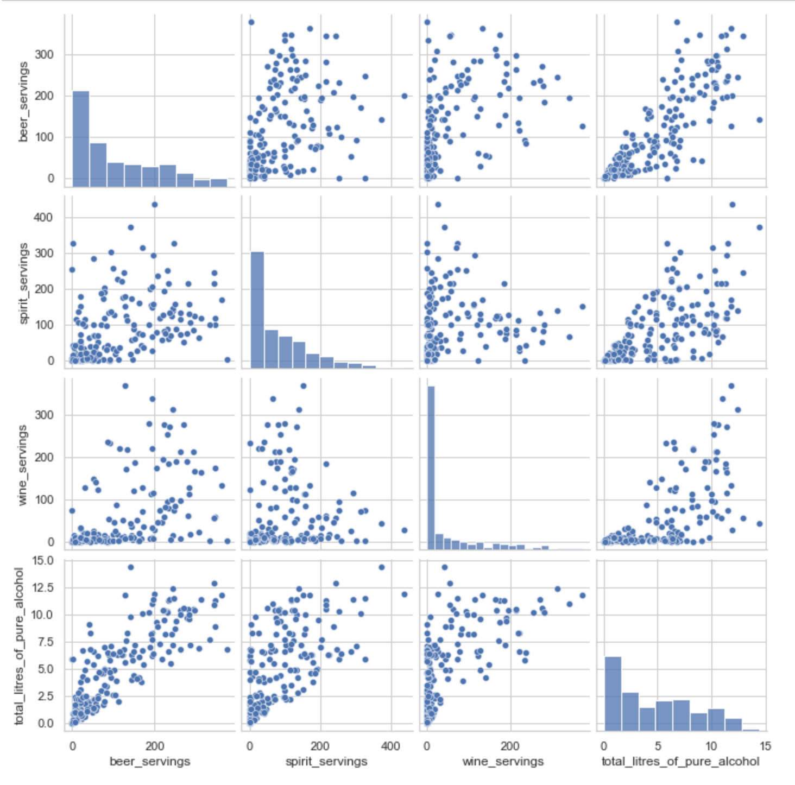

# 01_데이터에서 인사이트 발견하기

> 우리는 왜 데이터를 분석하려고 할까? 바로 문제해결을 위한 Insight 를 얻기 위해서

## 1.1 탐색적 데이터 분석의 과정

> 데이터 분석의 기본인 EDA (Exploratory Data Analysis)

### 1. 탐색 ( 데이터의 기초 정보 살펴보기 )

1. 데이터의 출처와 주제에 대해 이해

2. 데이터의 크기 확인

3. 데이터의 구성 요소 (피처) 살펴보기

   - 피처: 데이터를 구성하는 요소

     


### 2. 인사이트 발견

- 피처의 속성 탐색

  

- 피처 간의 상관 관계 탐색


### 3. 탐색한 데이터의 시각화


## 1.2 멕시코풍 프랜차이즈 chipotle 의 주문 데이터 분석하기

> 주문데이터를 불러와 기초정보 살펴보고 탐색 / 시각화를 수행해보고 이 예제로 전처리를 해보고 이런저런 인사이트를 살펴보자
>
> 흐름은 순차적으로 내가 원하고자 하는 넓은 범위 조건의 df 를 만들고, 계속해서 df 를 만들어가면서 결국 원하는 specific 한 조건의 df 를 만드는 듯

### Step 1. 탐색: 데이터의 기초 정보 살펴보기

- 불러오기

  ```python
  import pandas as pd
  file_path = '../data/chipotle.tsv'
  chipo = pd.read_csv(file_path, sep='\t') # chipo 는 Datafram 객체가 된다.
  ```

- 정보확인

  ```python
  print(chipo.shape) # (행수, 열수)
  chipo.info() # df 의 정보들 표출
  chipo # 테이블 형태로 보여줌
  chipo['item_name'] / chipo.item_name # 이 둘은 Series 객체가 된다. 해당 피처의 값들
  ```

- 수치적 특성들 파악

  ```python
  print(chipo.describe()) # 이런저런 통계량들을 보여줌
  print(len(chipo['item_name'].unique())) # item_name 피처의 유일값 series 의 길이를 출력
  ```

  

### Step2. 인사이트의 발견: 탐색과 시각화

- 가장 많이 주문한 item top 10

  ```python
  item_count = chipo['item_name'].value_counts()
  
  for idx, (val, cnt) in enumerate(item_count.iteritems(), 1): # iteritems 는 series 를 (idx, val) 튜플로 "하나씩" 반환함
    print("Top", idx, ":", val, cnt)
    
  ```

- Item 당 주문 개수 / 

  ```python
  order_count = chipo.groupby('item_name')['order_id'].count() # item_name 별로 묶어서 주문개수를 샌 것
  item_quantity = chipo.groupby('item_name')['quantity'].sum() # item_name 별로 묶어서 총량들을 모두 더한 것
  ```

- 아이템당 주문개수 시각화

  ```python
  %matplotlib inline # matplot 쥬피터에서 쓴다는 선언
  import numpy as np
  import matplotlib.pyplot as plt
  
  item_name_list = item_quantity.index.tolist() # x 축에 들어갈 상품 인덱스
  
  x_pos = np.arange(len(item_name_list))
  order_cnt = item_quantity.values.tolist()
  
  Plt.bar(x_pos, order_cnt, align='center')
  plt.ylabel('order_item_count')
  plt.title('Distribution of all orderd item')
  
  plt.show()
  ```

  

### Step3. 데이터 전처리

- Item_price 피처가 $--- 인 object 이기 때문에, $를 없앤 int64 로 바꿔주자

  ```python
  chipo['item_price'] = chipo['item_price'].apply(lambda x: float(x[1:]))
  ```


### Step4. 이런저런 인사이트

- 주문당 평균 계산금액

  ```python
  chipo.groupyby('order_id')['item_price'].sum().mean()
  ```

- 한 주문에 10달러 이상 사용한 주문 번호 출력

  ```python
  chipo_orderid_group = chipo.groupby('order_id').sum()
  
  results = chipo_orderid_group[chipo_orderid_group.item_price >= 10] # pandas 에서 이런식으로 조건문 인덱싱 가능
  ```

- 각 아이템의 가격 구하기

  ```python
  chipo_one_item = chipo[chipo.quantity == 1]
  price_per_item = chipo_one_item.groupby('item_name').min()
  price_per_item.sort_values(by = "item_price", ascending = False)[:10]
  ```

- 아이템 가격 분포 그래프 출력

  ```python
  item_name_list = price_per_item.index.tolist()
  x_pos = np.arange(len(item_name_list))
  item_price = price_per_item['item_price'].tolist()
  
  plt.bar(x_pos, item_price, align='center')
  plt.ylabel('item price($)')
  plt.title('Distribution of item price')
  
  plt.show()
  ```

- 아이템 가격 히스토그램

  ```python
  item_name_list =. rice_per_item.index.tolist()
  x_pos =. p.arange(len(item_name_list))
  item_price =. rice_per_item['item_price'].tolist()
  
  plt.bar(x_pos, item_price, align='center')
  plt.ylabel('item price($)')
  plt.title('Distribution of. tem price')
  
  plt.show()
  ```

- 가장 비싼 주문에서 아이템의 개수가 몇개인지

  ```python
  chipo.groupby('order_id').sum().sort_values(by='item_price', ascending=False)
  ```

- "Veggie Salad Bowl" 이 몇 번 주문되었는지 확인

  ```python
  chipo_salad = chipo[chipo['item_name'] == "Veggie Salad Bowl"]
  chipo_salad = chipo_salad.drop_duplicates(['item_name', 'order_id']) # item_name과 order_id 가 같은 행들을 없애준다.
  ```

- Chicken Bowl 을 2개 이상 주문한 주문 횟수 수하기

  ```python
  # Chicken Bowl 을 몇 개 주문했는지에서 조건으로 필터링해서
  Chipo_chicken = chipo[chipo['item_name'] == "Chicken Bowl"]
chipo_chicken_result = chipo_chicken[chipo_chicken['quantity'] >= 2]
  
  # 해당 df 의 차원에서 row 만 뽑아냄
  print(chipo_chicken_result.shape[0])
  ```
  
- Chicken Bowl 을 2 개 이상 주문한 고객들의 "Chicken Bowl" 메뉴의 총 주문 수량

  ```python
  chipo_chicken = chipo[chipo['item_name'] == "Chicken Bowl"]
  chipo_chicken_ordersum = 
  # 양의 총 합을 나타내는 df 를 만들어서 값이 2 이상인 것 만들기
  chipo_chicken.groupby('order_id').sum()['quantity']
  chipo_chicken_result = chipo_chicken_ordersum[chipo_chicken_ordersum >= 2]
  
  print(len(chipo_chicken_result))
  chipo_chicken_result.head(5)
  ```

  

## 1.3 국가별 음주 데이터 분석하기

> 위 chipo 와 비슷하니, 이제 좀 더 라이브러리에 대해 익숙해져보자

### Step 1 탐색: 데이터의 기초 정보 살펴보기

- 데이터셋 기본 정보 가져오기

  ```python
  import pandas as pd
  import numpy as np
  import matplotlib.pyplot as plt
  
  file_path = '../data/drinks.csv'
  drinks = pd.read_csv(file_path)
  ```

- 정보들을 한 번 보자

  ```python
  print(drinks.info())
  ```

  ```python
  drinks.head(10)
  ```

  

### Step 2 인사이트 발견: 탐색과 시각화하기

- 피처 간 상관관계

  > #### 상관분석
  > 상관 분석이란 두 변수 간의 선형적 관계를 상관 계수로 표현하는 것
  > 상관 계수를 구하는 것은 공분산의 개념을 포함
  > 공분산: 2개의 확률 변수에 대한 상관 정도, 2개의 변수 중 하나의 값이 상승할 때 다른 값이 얼마나 상승하는지의 수치
  > But, 공분산만으로 구하면 두 변수의 단위 크기에 영향을 받을 수 있어서 -1 과 1 사이인 상관계수로 바꾼다.
  > 1에 가깝다면 양의 상관관계, -1에 가깝다면 음의 상관관계

  - 두 피처간 상관계수

    - 

  - 여러 피처간 상관관계

    - ```python
      # 상관관계를 알려주는 매서드 corr 인자중 pearson
      cols = ['beer_servings', 'spirit_servings', 'wine_servings', 'total_litres_of_pure_alcohol']
      corr = drinks[cols].corr(method = 'pearson')
      print(corr)
      ```

- corr 행렬 히트맵 시각화하기

  ```python
  import seaborn as sns
  
  # corr 행렬 히트맵을 시각화합니다.
  cols_view = ['beer', 'spirit', 'wine', 'alcohol'] # 그래프 출력을 위한 cols 이름을 축약합니다.
  sns.set(font_scale=1.5)
  hm = sns.heatmap(corr.values,
              cbar=True,
              annot=True, 
              square=True,
              fmt='.2f',
              annot_kws={'size': 15},
              yticklabels=cols_view,
              xticklabels=cols_view)
  
  plt.tight_layout()
  plt.show()
  ```

  


- 피처 간 scatter plot 출력

  ```python
  # 시각화 라이브러리를 이용한 피처간의 scatter plot을 출력합니다.
  sns.set(style='whitegrid', context='notebook')
  sns.pairplot(drinks[['beer_servings', 'spirit_servings', 
                       'wine_servings', 'total_litres_of_pure_alcohol']], height=2.5)
  plt.show()
  ```

  


### Step3. 탐색적 분석: 스무고개로 분석

- continent 피처에 대한 결측 데이터 전처리

  > 결측치 
  >
  > ​	누락된 데이터

  ```python
  # 결측데이터를 처리합니다 : 기타 대륙으로 통합 -> 'OT'
  drinks['continent'] = drinks['continent'].fillna('OT')
  ```

- 파이차트 시각화

  ```python
  # 라이브러리는 끝이 없다
  labels = drinks['continent'].value_counts().index.tolist()
  fracs1 = drinks['continent'].value_counts().values.tolist()
  explode = (0, 0, 0, 0.25, 0, 0)
  
  plt.pie(fracs1, explode=explode, labels=labels, autopct='%.0f%%', shadow=True)
  plt.title('null data to \'OT\'')
  plt.show()
  ```

  