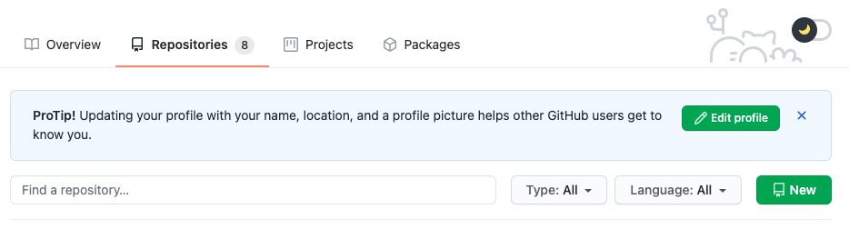
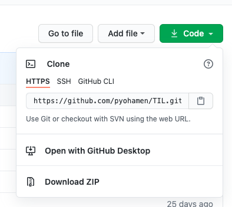
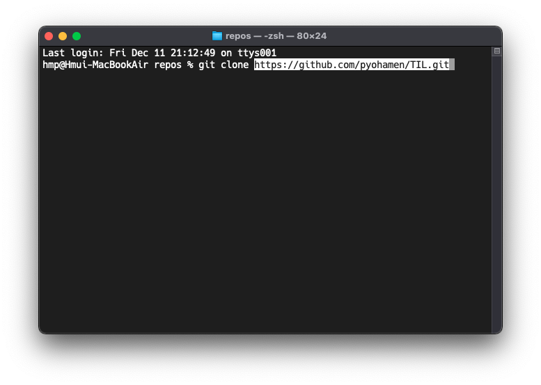

# Git 101

* **what is Git ?**
  * **Git** is a [distributed version-control](https://en.wikipedia.org/wiki/Distributed_version_control) system for tracking changes in [source code](https://en.wikipedia.org/wiki/Source_code) during [software development](https://en.wikipedia.org/wiki/Software_development). It is designed for coordinating work among [programmers](https://en.wikipedia.org/wiki/Programmer), but it can be used to track changes in any set of [files](https://en.wikipedia.org/wiki/Computer_file). Its goals include speed, [data integrity](https://en.wikipedia.org/wiki/Data_integrity), and support for distributed, non-linear workflows.
  * Ref\) [wiki](https://en.wikipedia.org/wiki/Git)


### Before getting start

1. You need a Github account

   - Github

     > [https://github.com/](https://github.com/)
     >
     > **GitHub, Inc.** is an [American](https://en.wikipedia.org/wiki/United_States) [multinational corporation](https://en.wikipedia.org/wiki/Multinational_corporation) that provides [hosting](https://en.wikipedia.org/wiki/Internet_hosting_service) for [software development](https://en.wikipedia.org/wiki/Software_development) and [version control](https://en.wikipedia.org/wiki/Version_control) using [Git](https://en.wikipedia.org/wiki/Git).
     >
     > Ref\) [wiki](https://en.wikipedia.org/wiki/GitHub)
     >
     > 쉽게 말해서, Git 은 버전관리 "시스템" 이고, github 은 Git 시스템을 제공하는 회사

2. if you use Window OS, I recommand you Gitbash. 

   - Gitbash

     > 윈도우에서 bash 를 사용하게 해줌
     >
     > Powershell 커맨드창에서도 git 명령어를 사용할 순 있지만, 굳이 git 에서 윈도우를 위해 만든 git bash 를 안 쓰고 Powershell 을 사용할 이유가 없음
     >
     > you can download at [here](https://gitforwindows.org/)
     >
     > !! 깃배쉬 설치할 때 우클릭으로 깃배쉬 여는 선택사항이 있는데 이거 꼭 해주길 권장한다.


### Making repository

> github 에서 자신의 pjt 들을 repository 별로 관리한다.

> 보통 로컬에서 pjt 최상위 디렉토리를 github 에 연결해서 ( init ) 디렉토리를 github 에 repository 로 띄우는 방식이지만, 난 github 페이지에서 repo 를 만들고 로컬로 클론해서 내 코드를 로컬에 클론된 repo 디렉토리에 복붙하고 push 하는 방식을 선호한다.

> 이유: 간단하고 오류날 일이 없음

#### 1. github 에서 repo 만들기



- Repositories 탭에 들어가면 우측에 New 버튼을 누른다.

- pjt 의 이름을 repo 이름으로 정하고 Add a README 은 체크하는걸 권장한다.
  - README.md 파일은 최상단 디렉토리에서 프로젝트에 대한 설명을 담당한다.
- 그리고 깃헙에서 default branch 가 언젠가 master 말고 뭐 다른걸로 되어있었는데 대부분 개발자가 master 브랜치를 사용하므로 저렇게 해주는걸 권장함



- 만들고 repo 에 들어가면 우측에 코드를 누르면 repo 를 clone 할 수 있는 경로를 복사할 수 있다.



- 이제 로컬로 돌아와서 내가 이 repo 를 clone 싶은 위치에서 터미널을 열어준다. ( window 는 해당 위치에서 우클릭으로 깃배쉬 열어서 ) 아래 명령어를 입력하고 경로를 복사한다.

  ``` bash
  git clone [경로]
  ```


#### 2. Push 하기

> 지금부터 순서를 잘 기억해야함

- ```bash
  git add .
  ```

- ```bash
  git commit -m '[쓰고싶은 말]'
  ```

- ```bash
  git push
  # 아니면
  git push origin master
  # origin 은 어떤 브랜치에 푸쉬할 것인지에 대한 옵션인데, default 로 현재 브랜치 ( 변경하지 않은 이상 master ) 이니 그냥 해도 됨
  # 브랜치에 대해서는 뒤에서 정리
  ```

- 위 세 가지 명령어를 수행하면 로컬의 내용이 github 의 repo 로 push 되는 것


#### 3. pull 하기

> 이건 뭐냐면 여러 로컬에서 작업을 할 경우 다른 로컬에서 push 된 코드를 현재 로컬에 내려받을 때 사용한다. 
>
> 협업을 한다면, 다른 개발자가 push 한 것을 내 로컬에서 업데이트 해야하기 때문에

- ```bash
  git pull
  # 이것도 마찬가지로 origin 옵션을 해당에 맞게 해주면 된다.
  git pull origin master
  
  ```


### Summary

1. Git 은 분산 버전 관리 "시스템"
2. Github 은 git 시스템을 제공하는 곳
3. pjt 별로 github 의 repository 에서 관리함