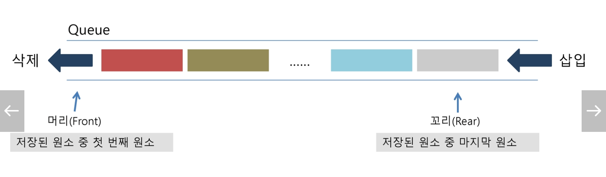

# Queue

> A data structure with limited location for insertion and deletion, as with stacks.
>
> F.I.F.O ( First In First Out)





### Head & Tail

1. Head

   : the first (the oldest) element in the queue

2. Tail

   : the last element (the newest) in element in the queue


### Enqueue & Dequeue

1. Enqueue

   : add an element to the tail

2. Dequeue

   : remove the head element

3. Peek

   : look at the head element, but not removing it


## Deque

: a queue that goes both ways

-> you can enqueue & dequeue from either end

-> kind of a generalized version of both stacks & queues since you could represent either of them with it!


### Implementation

```python
from collections import deque

q = deque()
q.append([1,2,3])
q.append([4,5,6])

# Head 삭제 ( 리스트에서 pop(0) 하는 것 보다, deque 를 import 해서 popleft 를 쓰는게 빠르다.)
q.popleft()

print(q)
=> [4,5,6]
```


## Priority Queue

- assign each element a numerical priority when you insert it into the queue
- remove the element with the highest priority when you dequeue

-> if the elements have the same priority, the oldest element is the one that gets dequeue first

