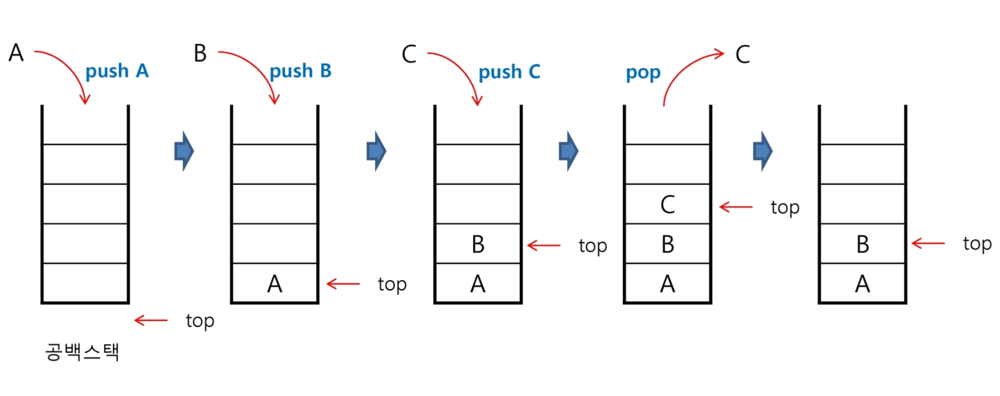

# Stack

> Structure with limited access to data.
>
> L.I.F.O. ( Last In First Out ) Structure

### How it works?

- You keep putting elements on top
- You have easy access to remove or look at the top element

### When to use?

- when you only care about the most recent elements
- the order in which you see & save elements actually matters

### Push & Pop

1. Push

   : when you add an element to a stack

   -> O(1)

2. Pop

   : when you taken an element off of the stack

   -> O(1)

 => All you need here is to look at the top element of the stack!

### Stack in Python

- `pop()` is a given function
- `append()` is equivalent to a push function

Make your own code instead of using `append()` since it traverses the whole list, taking O(n)

-> it will take a lot faster if we push/pop from the first element in a linked list!