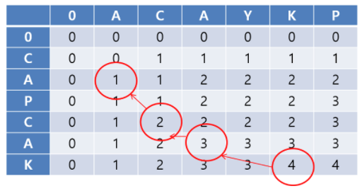

# Dynamic programming

> 컴퓨터를 이용해도 시간이 매우 많이 필요하거나 메모리 공간이 매우 많이 필요하면 해결하기 어렵다.
>
> 메모리 공간을 약간 더 사용하면, 연산 속도를 비약적으로 증가시킬 수 있고, 대표적인 방법으로 다이나믹 프로그래밍 기법. 동적 계획법이다.


- 다이나믹 프로그래밍과 동적 할당의 다이나믹은 같은 의미일까?

  ```
  Dynamic: 
  	프로그램이 실행되는 도중에
  	
  ex) 자료구조에서 동적할당 (Dynamic Allocation) 은 프로그램 실행 중 프로그램에 필요한 메모리를 할당하는 기법.
  ```


## 다이나믹 사용조건

1. 큰 문제를 작은 문제로 나눌 수 있다.
2. **작은 문제에서 구한 정답은 그것을 포함하는 큰 문제에서도 동일하다.**

- 위 조건을 만족하는 대표 문제: 피보나치

  ```python
  def fibo(n):
    if n == 1 or 2:
      return 1
    return fibo(n - 1) + fibo(n - 2)
  ```

  - O(2^N) 의 계산 복잡도를 가져 100 만 되더라도 수백억년이 걸린다.


## Memoization (Top - Down)

> 다이나믹 프로그래밍을 구현하는 방법 중 한 종류.
> 한 번 계산한 결과를 어딘가에 담아두는 것을 의미
>
> 한 번 구한 결과를 메모리 공간에 메모해두고 같은 식을 다시 호출하면 메모한 결과를 그대로 가져옴
>
> 캐싱 (Caching) 이라고도 함

- Implementation

  - 한 번 구한 정보를 리스트에 저장. 재귀적으로 수행하다가 같은 정보가 필요할 때 이미 구한 정답을 리스트에서 가져옴

    > 큰 문제를 해결하기 위해 작은 문제를 호출

    ```python
    # 한 번 계산된 결과를 메모이제이션 (memoization) 하기 위한 리스트 초기화
    d = [0] * 100
    
    # 피보나치 함수를 재귀적으로 구현 (탑다운 다이나믹 프로그래밍)
    def fibo(x):
      	# 종료 조건
        if x == 1 or 2:
        		return 1
      	# 이미 계산한 적 있는 문제라면 그대로 반환
      	if d[x] != 0:
        		return d[x]
      	# 아직 계산하지 않은 문제라면 점화식에 따라서 피보나치 결과 반환
      	d[x] = fibo(x - 1) + fibo(x - 2)
      	return d[x]
    ```

- 때에 따라서 다른 자료형, 예를 들어 사전(dict) 자료형을 이용할 수도 있다. 수열처럼 연속적이지 않은 경우 유용함.

  

  

## Bottom - Up

> 다이나믹 프로그래밍의 전형적인 형태
>
> 반복문을 이용해 작은 문제부터 차근차근 답을 도출

```python
# 앞서 계산된 결과를 저장하기 위한 DB 테이블 초기화
d = [0] * 100

# 첫 번째 피보나치 수와 두 번째 피보나치 수는 1
d[1] = 1
d[2] = 1
n == 99

# 피보나치 함수 반복문으로 구현
for i in range(3, n + 1):
    d[i] = d[i - 1] + d[i - 2]
```


## LIS (가장 긴 증가하는 부분 수열)

D[i]: a[i] 로 끝나는 가장 긴 수열

```python
for i in range(n):
    for j in range(i):
            # 애초에 i 번째가 가장 크지 않으면 의미가 없기 때문에
    		if a[j] < a[i]:
        		D[i] = max(D[j] + 1, D[i])
```


## LCS (최장 공통 부분 문자열)

한 문자열을 기준으로 하나씩 해나감

1. String1[i] == String2[j] 라면 [i, j] = [i - 1, j - 1] + 1
2. String1[i] != String2[j] 라면 [i, j] = [i - 1, j] 와 [i, j - 1] 중 큰 것




# Knapsack Problem

2차원 DP 로 매 순간 들어오는 물건에 따라 새로운 행을 채워나가보자


## 편집거리

[블로그](https://hsp1116.tistory.com/41)


## etc

- 대부분 DP 핵심은, 매 번마다 **최선의것** 을 택해가는 것이니 **비교대상** 을 잘 검증하자
  - 작은 경우의 **어떤** 해가 적용되는지 잘 보자
- DP 테이블
  - 테이블을 어떻게 구성할지, 몇 차원
  - 행, 열은 어떻게 정할지
  - 이전의 값을 어떻게 참고해서 현재값을 결정하는지
- 코테에서 다이나믹 프로그래밍은 대체로 간단한 형태로 출제된다.
- 주어진 문제가 다이나믹 프로그래밍 유형인지 파악하자
  - **문제에서 작은 문제의 정답이 이 작은 문제를 포함하는 큰 문제에서도 동일한 것인지 파악이 중요**
  - **근데 이건 보텀업방식으로 0, 1, 2 를 하다보면 규칙이 보이고, 중복되는걸 사전에 방지하기 손쉽다.**
- 일단 재귀함수로 작성하고, 작은 문제에서 구한 답이 큰 문제에서 그대로 사용된다면 메모이제이션을 활용
- 가능하다면 보텀업 방식을 권장
  - recursion depth 오류가 날 수 있다
    - Sys.setrecursionlimit() 매서드 호출하여 완화할 수 있음