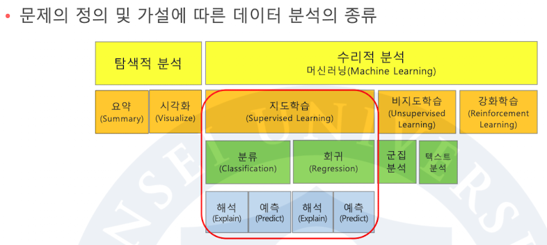
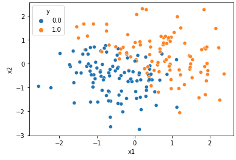
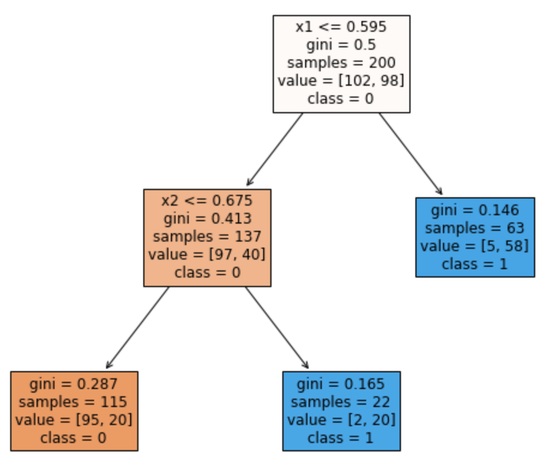
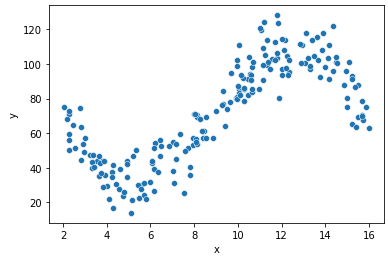
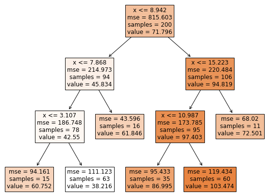
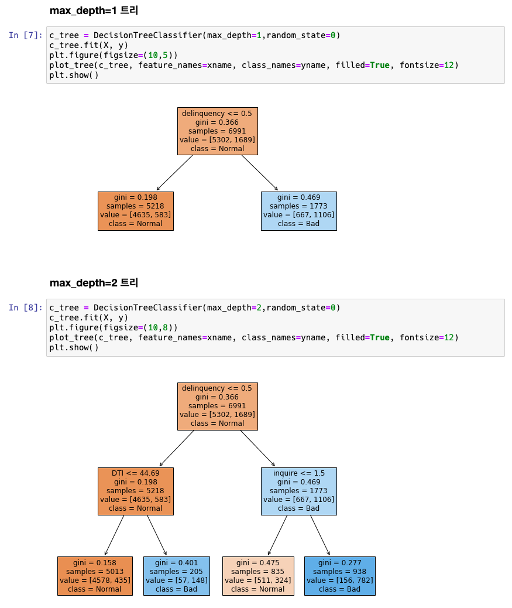
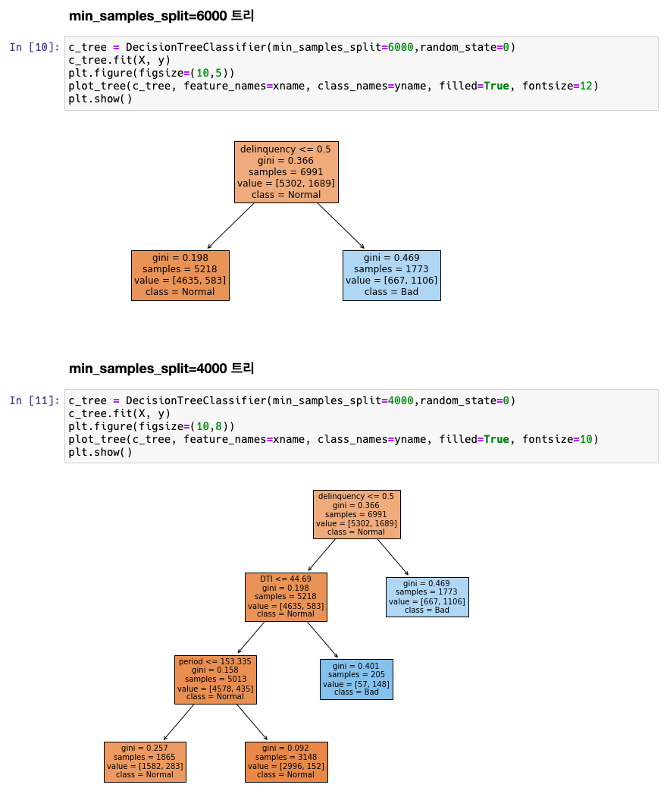
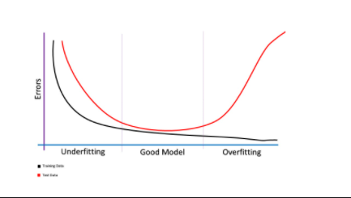
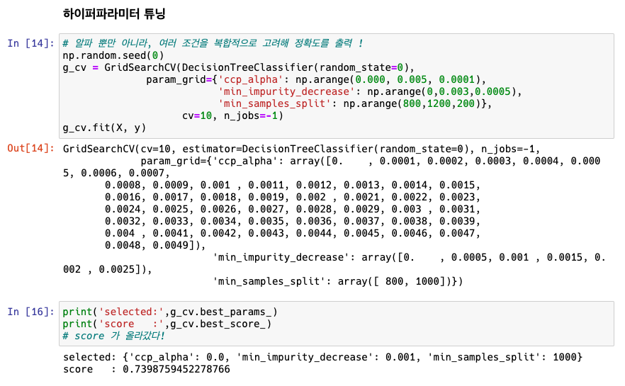
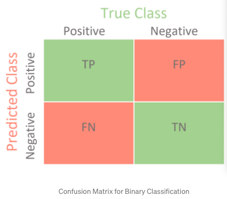

# 01 의사결정나무 소개

## 데이터 분석의 종류

## 의사결정나무 구조

- 그래프 Model
- 나무모형의 구성요소
  1. 뿌리노드 (root node)
  2. 중간노드 (intermediate node)
  3. 최종노드 (terminal node)
- 두 종류
  1. 분류나무
  2. 회귀나무

## 분류나무 예시

> y 변수: 범주형 x1, x2 변수: 연속형 일 때

- 수직선을 이용하여 분류경계선을 통해 모자이크를 만든다.
- 이를 통해 각 모자이크에서 y 가 무엇일지에 대한 확률을 얻을 수 있음

> 로지스틱 회귀문석은 직선이라서 이러한 경우 오분류가 많음

- 

## 회귀나무 예시

> y변수: 연속형, x변수: 연속형

- Python 에서 가장 먼저 선택하는 피처가 결정된다.

# 03 의사결정나무 원리 1

## 의사결정(분류)나무 원리

> 대원칙: 한쪽 방향으로 쏠림

## '한쪽방향으로 쏠림' 계량화 방법

- 불순도 함수 정의 (y 가 순수해졌는지 !)

- 지니불순도 (Gini impurity)

  
  $$
  =1 -𝜮_{j=1}^{K}(P_j)^2
  $$

## 향상도(Goodness of split)

= 분류하기 전인 노드 t 의 불순도 - (t1 과 t2) 노드의 불순도 가중평균

## Greedy Search

각 영역의 지니불순도의 가중평균이 가장 작아지는 분류지점을 찾는다.

# 04 의사결정나무 원리 2

## 여러 개의 연속형 변수

- 모든 X변수에 한번씩의 기회를 준다

## 범주형 변수

1. 범주값을 sorting
2. 순서대로 정수화 한다.

## Split 변수 선택

- 모든 X 변수에 대해서 한번씩 Greedy Search 한다

## 재귀적 분할 (Recursive Partition)

- 모든 하위 노드에 대해 Greedy Search 진행한다.

# 05 CART 의사결정나무

> 의사결정 나무는 여러 이름이 있는데, 그 중 대표적인 나무

- Breiman, Friedman, etc. 1984
- 이진분할 (Binary decision rule)
  - 삼진분할 안 함!
- 연속형 변수 부등호 활용
- 범주형 변수 부분집합 활용
- Divide-and-conquer approach
  - 분할하여 각각의 지니불순도 계산
- Greedy search using impurity measure
- 한번에 변수 한개씩 (One variable at a time)

## 불순도 종류

- 지니불순도(CART) GINI:
  $$
  imp(t) = 1 - 𝜮_j (p_j)^2
  $$
  
- 엔트로피(C4.5) Entropy:
  $$
  imp(t) = -𝜮_jp_jlog(p_j)
  $$
  
- 이탈도 Deviance:
  $$
  imp(t) = -2𝜮_jn_jlog(p_j)
  $$

  > 이걸 이용한 의사결정 tree 는 없음. unusual

## 최대트리

> 모든 모자이크의 불순도가 0이 될 때까지 재귀적분할 수행한 것

- 기본적으로 좋은게 아님
- 과적합 (overfiting) 된 것이라고 볼 수 있음
- 모자이크가 최대인 것

# 08 의사결정나무 정지규칙

> 최대트리는 좋은 것이 아니니 재귀적분할을 정지하는 규칙을 통해 제한해보자

## 정지규칙 (Stopping Criteria)

- 최대깊이 조정: 최대로 내려갈 수 있는 depth

  

  

- 최소 노드크기 조정

  - 노드를 분할하기 위해 필요한 데이터 수
  - 노드에 이 값보다 적은 데이터가 있다면 Stop

  

- 최소 향상도 조정: 노드를 분할하기 위한 최소 향상도 (향상도가 0.1 이하면 divide 안 함)

  

## 비용복잡도 (Cost-complexity) 함수

- Impurity(T) + 𝜶|T|
- |T| 는 최종노드의 개수
- 𝜶: 패널티 계수 (사용자가 선택, 트리 사이즈에 대한 패널티를 얼마나 주느냐)

- 𝜶 = 0 이라면, 최대크기의 트리가 가장 선호됨
- 𝜶 가 크다면 뿌리노드가 트리 가장 선호됨
- 각 𝜶 마다 가장 Cost 를 적게 하는 트리 T 가 존재
- 𝜶 가 작을수록, 트리는 커짐

# 10 의사결정나무 크기결정 1

## 과소적합 (Underfitting)

- 해석은 단순
- 학습데이터의 예측력 나쁨
- 평가데이터의 예측력 나쁨

## 과대적합 (Overfitting)

- 해석 어려움
- 학습데이터의 예측력 좋음 (거의 완벽)
- 평가데이터의 예측력 나쁨

## 트리의 크기 결정 문제

- 여러 가지 정지규칙이 존재함
- 사용자의 선택에 의해 다양한 크기의 트리가 나올 수 있음
- Question: 트리의 크기를 자동적으로 결정해주는 방법은?
  - Ans: Prunning (가지치기) 기법을 활용하자

## 트리의 크기와 예측력

최대 트리는 과대적합, 최소 트리는 과소적합

## 최적의 𝝰 값을 찾자

평가데이터의 불순도를 추정해야 의미가 있는데, K-fold 교차검증을 통해 평가데이터를 시도해볼 수 있다.

# 11 의사결정나무 크기결정 2

## 가지치기 (Pruning)

- 오분류을을 크게 할 위험이 높은 가지를 제거
- 예측오차가 가장 적어지는 트리를 선택

## 의사결정나무 튜닝

- 의사결정나무는 여러개의 Hyper-parameter 가 존재

  - Max_depth
  - Min_sample_split
  - Min_impurity_decrease
  - Cup_alpha

- Cross-validation 으로 예측력이 가장 좋은 최적 parameter 의 조합을 찾자

  

# 13 의사결정나무 비교

## 분류분석 비교의 종류

- 해석력
  - 의사결정나무의 경우, 적당한 크기의 트리가 해석력이 좋다
- 예측력
  - 큰 크기의 트리가 예측력이 좋다
  - Pruning, 튜닝 은 예측력을 고려

## Loan 데이터 예측력 비교

- Y 의 양이 차이가 많이 나는 불균형 데이터 일 때
- 층화추출의 개념으로 해결
- y 기준으로 Stratify (층으로 나누다)

# 15 회귀나무

> x, y 둘 다 연속형일 때 !

## 원리

- 대원칙: 분산이 적어져야 함
  - 한 노드 안에서 Y 의 분산이 작아야 함

> c.f. 분류나무는 불순도가 작아야 함

# 17 의사결정나무 장단점

## 나무모형의 장단점

장점

- 해석의 용이성 (이해하기 쉬운 규칙을 생성)
  - 일반적으로 머신러닝에선 안 좋음
- 변수의 개수에 영향을 덜 받음
  - small n ,large p 에서 더 좋긴 함
- 변수의 중요도 파악됨
  - 중요한 변수일수록 상위노드에 나타남
  - 이를 통해 X 변수 선택 가능하여 신경망, SVM 등에 사용할 수 있다.

단점

- 예측표면이 매끄럽지 못 함
  - 다른 방법에 비해 예측력이 떨어짐
- 마찬가지로 회귀나무에서도 모서리쪽에 정확도가 떨어짐

# 18 모형비교의 종류

## 분석모형 비교의 종류

해석력

- 단순한 모형일수록 해석력이 좋음
- 선형모형이 해석력이 좋은 (선형회귀분석, 로지스틱 회귀분석)
- 머신러닝(대부분 해석력이 안 좋지만) 방법중에는 의사결정나무가 해석력이 좋다

예측력

- 학습데이터로 모형을 만들고, 학습데이터에서 예측력이 좋은건 의미가 없음
  - 과적합을 선호할 수 없으니 !
- 데이터를 분할 하여 예측력을 검증하자
- 특정 한 방법이 모든 데이터에 대해 예측력이 좋은게 아님
  - 데이터마다 비교해 보자

## 데이터 분할

Training / Test 로 나눌 수 있으며 층화추출이 중요함

# 19 분류분석 모형 비교 1

Accuracy 계열

> 추천하진 않지만, 선이해가 필요하다

- 정확도
- 민감도 = 재현율
- 특이도
- 정밀도
- F1 - score

ROC 계열

- ROC 커브
- AUROC (AUC)

## Confusiion Matrix

> 확률로 나눠진 Tree 를 어느 확률을 기준을 T/F 을 정해야 한다. Cut-off(threshold)
>
> 따라서 Cut-off 값에 따라 정확도가 바뀐다

- 정확도 = TP + TN / N

- 민감도 = TP / TP + FN

- 특이도 = TN / TN + FP

- 정밀도 = TP / TP + FP

- F1 - score = 2 * 정밀도 * 민감도 / 정밀도 + 민감도

  > 조화평균

# 21 분류분석 모형 비교 2

## ROC curve

Idea

- Cut-off 에 따라, 민감도와 특이도는 반비례 관계이다

Method

- Cut-off 에 따라 특이도와 민감도를 여러 개 계산하여
  - x축: 1 - 특이도
  - y축: 민감도
- 민감도가 더 높은 모형이 우수 !

result

- 차지하는 영역의 크기가 클수록 성능이 좋음

# 23 회귀분석 모형 비교

## 예측성능 평가 기준

예측결정계수 (예측 R^2)

- 실제 값과 예측 값 사이의 상관계수 제곱

$$
R^2 = corr(y, \hat{y})^2 = 1 - \frac{𝛴_{i=1}^n(y_i-\hat{y}_i)^2}{𝛴_{i=1}^n(y_i-\bar{y}_i)^2}
$$

평균 절대 오차 (Mean absolute error; MAE)

- 실제 값과 예측 값 사이의 절대적인 오차의 평균

$$
MAE = \frac{1}{n}𝛴_{i=1}^n|y - \hat{y}|
$$

Mean absolute percentage error (MAPE)

> 오차의 실제값 대비 비율 까지 포함

- 실제값 대비 얼마나 예측값이 차이가 있는지를 %로 표현
- 상대적인 오차를 추정하는데 주로 사용

$$
MAPE = \frac{1}{n}𝛴_{i=1}^n\frac{|y_i-\hat{y}_i|}{|y_i|}
$$

MSE (Mean square error)

- 실제 값과 예측 값 사이의 오차의 제곱의 평균을 이용

$$
MSE = \frac{1}{n}𝛴_{i=1}^n(y_i-\hat{y}_i)^2
$$

