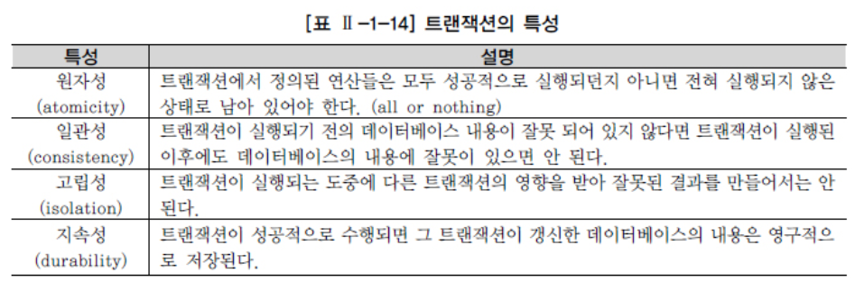

# TCL

## 1. 트랜잭션 개요

> 데이터베이스의 논리적 연산단위
>
> 밀접히 관련되어 분리될 수 없는 한 개 이상의 데이터베이스 조작
>
> 하나의 트랜잭션에는 하나 이상의 SQL 문장
>
> 계좌이체 같은 하나의 논리적인 작업 단위를 구성하는 세부적인 연산들의 집합
>
> 이런 관점에서 데이터베이스 응용 프로그램은 트랜잭션의 집합
>
> 올바르게 반영된 데 이터를 데이터베이스에 반영시키는 것을 커밋(COMMIT), 트랜잭션 시작 이전의 상태로 되돌리는 것을 롤백(ROLLBACK)이 라고 하며, 저장점(SAVEPOINT) 기능
>
> 트랜잭션의 대상이 되는 SQL문은 DML 문



## 2. COMMIT

> 입력한 자료나 수정한 자료에 대해서 또는 삭제한 자료에 대해서 전혀 문제가 없다고 판단되었을 경우 COMMIT 명령어를 통해서 트랜잭션을 완료
>
> COMMIT 명령어는 이처럼 INSERT 문장, UPDATE 문장, DELETE 문장을 사용한 후에 이런 변경 작업이 완료되었음을 데이터베이스에 알려 주기 위해 사용
>
> 이후
>
> - 데이터에 대한 변경 사항이 데이터베이스에 반영된다.
>
> 	- 이전 데이터는 영원히 잃어버리게 된다.
>  - 모든 사용자는 결과를 볼 수 있다.
>  - 관련된 행에 대한 잠금(LOCKING)이 풀리고, 다른 사용자들이 행을 조작할 수 있게 된다.

## 3. ROLLBACK

> 데이터 변경 사항이 취소되어 데이터의 이전 상 태로 복구
>
> 관련된 행에 대한 잠금(LOCKING)이 풀리고 다른 사용자들이 데이터 변경을 할 수 있게 된다.

## 4. SAVEPOINT

> 저장점(SAVEPOINT)을 정의하면 롤백(ROLLBACK)할 때 트랜잭션에 포함된 전체 작업을 롤백하는 것이 아니라 현 시점에 서 SAVEPOINT까지 트랜잭션의 일부만 롤백할 수 있다. 
>
> 복수의 저장점을 정의할 수 있으며, 동일이름으로 저장점을 정의했을 때는 나중에 정의한 저장점이 유효하다.
>
> ```sql
> SAVEPOINT SVPT1;
> ```
>
> ```sql
> ROLLBACK TO SVPT1;
> ```

​	

