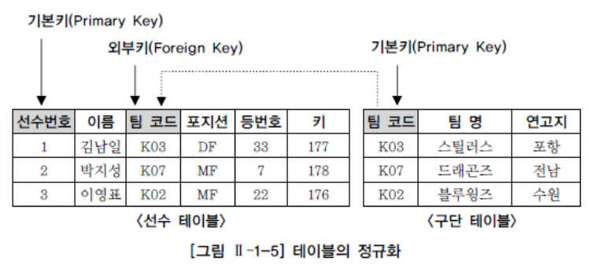

# 관계형데이터베이스개요

## 1. 데이터베이스

> 많은 사용자들은 보다 효율적인 데이터의 관리 뿐만 아니라 예기치 못한 사건으로 인한 데이터의 손상을 피하고, 필요시 필요한 데이터를 복구하기 위한 강력한 기능의 소프트웨어를 필요로 하게 되었고 이러한 기본적인 요구사항을 만 족시켜주는 시스템을 DBMS(Database Management System)라고 한다.

> SQL 관계형 데이터베이스를 유일하게 조작할 수 있는 문장

## 2. SQL (Structured Query Language)

> 데이터를 CRUD 하기 위한 매개 역할

| 명령어의 종류                                           | 명령어                                  | 설명                                                         |
| ------------------------------------------------------- | --------------------------------------- | ------------------------------------------------------------ |
| 데이터조작어                                            | SELECT                                  | 조회하거나 검색하기 위한 명령어로 RETRIEVE 라고도 함         |
| DML (Data Manipullation Language)                       | INSERT UPDATE DELETE          | 변형을 가하는 종류의 명령어들                                |
| 데이터 정의어 DDL (Data Definition Language)       | CREATE ALTER DROP RENAME | 테이블과 같은 데이터 구조를 정의하는데 사용되는 명령어들. 그러한 구조를 생성하거나 변경하거나 삭제하거나 이름을 바꾸는 데이터 구조와 관련된 명령어들 |
| 데이터 제어어 DCL (Data Control Language)          | GRANT REVOKE                       | 객체들을 사용하도록 권한을 주고 회수하는 명령어              |
| 트랜잭션 제어어 TCL (Transaction Control Language) | COMMIT ROLLBACK                    | 논리적 작업의 단위를 묶어 DML 에 의해 조작된 결과를 작업단위 (트랜재션) 별로 제어하는 명령어 |

## 3. TABLE

> 관계형 데이터베이서의 기본 단위
>
> 모든 자료는 테이블에 등록됨
>
> 우리는 테이블로부터 원하는 자료 꺼내옴

​	

| 용어                   | 설명                                                         |
| ---------------------- | ------------------------------------------------------------ |
| 정규화 (Normalization) | 테이블을 분할하여 데이터의 정합성을 확보하고, 불필요한 중복을 줄이는 프로세스 |
| 기본키 (Primary Key)   | 테이블에 존재하는 각 행을 한 가지 의미로 특정할 수 있는 한 개 이상의 칼럼 |
| 외부키 (Foreign Key)   | 다른 테이블의 기본키로 사용되고 있는 관계를 연결하는 칼럼    |

## 4. ERD (Entity Relationship Diagram)

