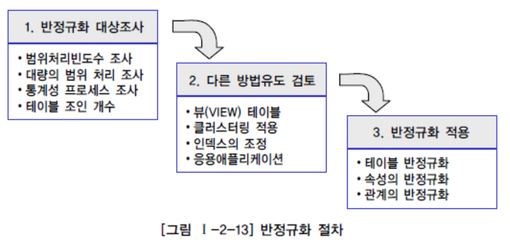
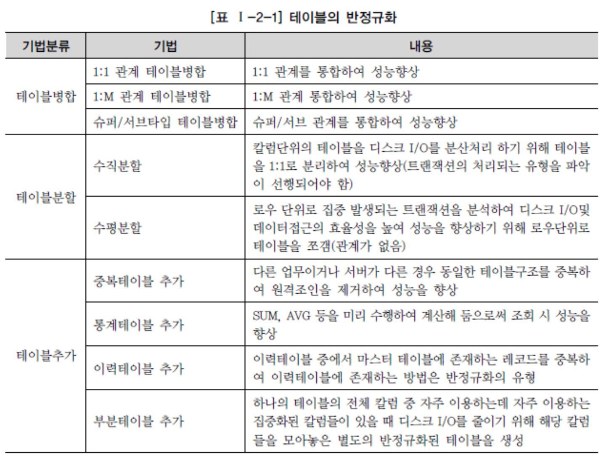
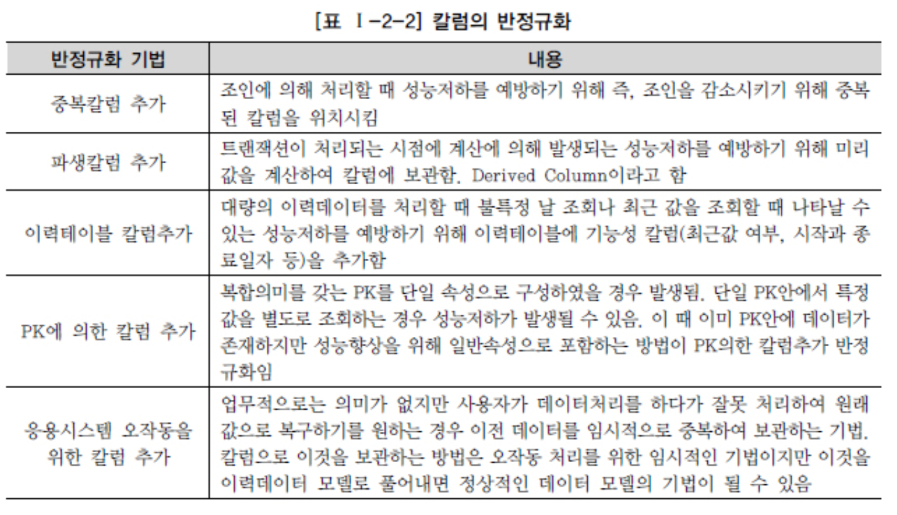
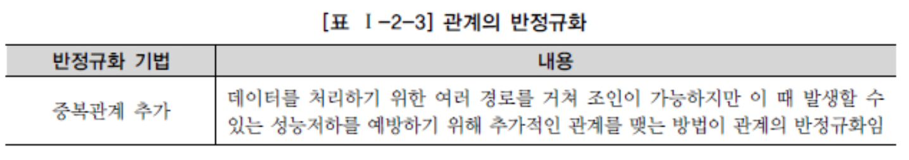

# 반정규화와 성능

## 1. 반정규화를 통한 성능향상 전략

1. ##### 반정규화 (=역정규화) 의 정의

   > 비정규화: 아예 정규화 수행 안 한 것

   > 정규화된 엔터티, 속성, 관계에 대해 시스템의 성능향상과 개발(Development)과 운영(Maintenanc e)의 단순화를 위해 중복, 통합, 분리 등을 수행하는 데이터 모델링의 기법

   > 데이터 무결성이 깨질 수 있는 위험을 무릅쓰고 데이터를 중복하여 반정규화를 적용하는 이유는 데이터를 조회할 때 디스 크 I/O량이 많아서 성능이 저하되거나 경로가 너무 멀어 조인으로 인한 성능저하가 예상되거나 칼럼을 계산하여 읽을 때 성능이 저하될 것이 예상되는 경우 반정규화를 수행

   > 정규화만을 수행하면 엔터티의 갯수가 증가하고 관계가 많아져 일부 여러 개의 조인이 걸려야만 데이터를 가 져오는 경우가 있다. 이러한 경우 업무적으로 조회에 대한 처리성능이 중요하다고 판단될 때 부분적으로 반정규화를 고려 하게 되는 것

   > 정규화의 함수적 종속관계는 위반하지 않지만 데이터의 중복성을 증가시켜야만 데이터조회의 성 능을 향상시키는 경우가 있다. 이러한 경우 반정규화를 통해서 성능을 향상

2. ##### 반정규화의 적용방법

   

## 2. 반정규화의 기법

1. ##### 테이블 반정규화

   

2. ##### 칼럼 반정규화

   

3. ##### 관계 반정규화

   

## 3. 정규화가 잘 정의된 데이터 모델에서 성능이 저하될 수 있는 경우

> 가장 최근에 변경된 값을 마스터 엔터티에 위치

## 4. 정규화가 잘 정의된 데이터 모델에서 성능이 저하된 경우

> DB 서버가 분산되어 있을 때