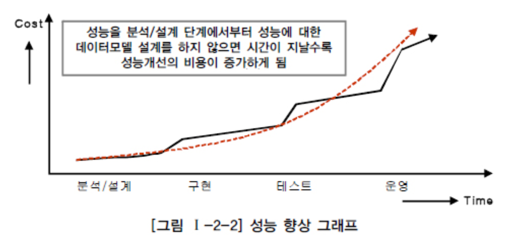

# 성능데이터모델링의 개요

## 1. 성능데이터 모델링의 정의

> 데이터베이스 성능향상을 목적으로 설계단계의 데이터 모델링떄부터 성능과 관련된 사항이 데이터 모델링에 반영될 수 있도록 하는 것

> 성능: 데이터조회 성능

## 2. 성능 데이터 모델링 수행시점

> 사전에 할수록 비용이 들지 않음
>
> ​	후에 SQL 문장을 튜닝하고, 부족한 하드웨어 용량을 증설하는 등 하면 추가비용 발생

## 3. 성능 데이터 모델링 고려사항

1. 데이터 모델링을 할 때 정규화를 정확하게 수행한다.
2. 데이터베이스 용량산정을 수행한다.
3. 데이터베이스에 발생되는 트랜잭션의 유형을 파악한다.
4. 용량과 트랜잭션의 유형에 따라 반정규화를 수행한다.
5. 이력모델의 조정, PK/FK조정, 슈퍼타입/서브타입 조정 등을 수행한다.
6. 성능관점에서 데이터 모델을 검증한다.