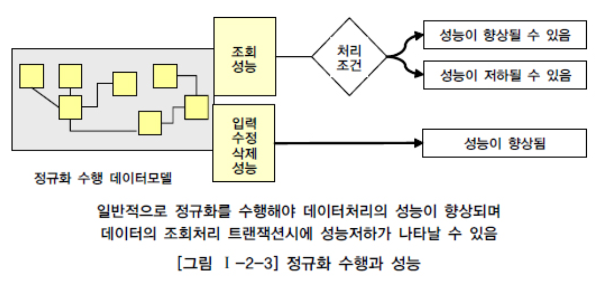
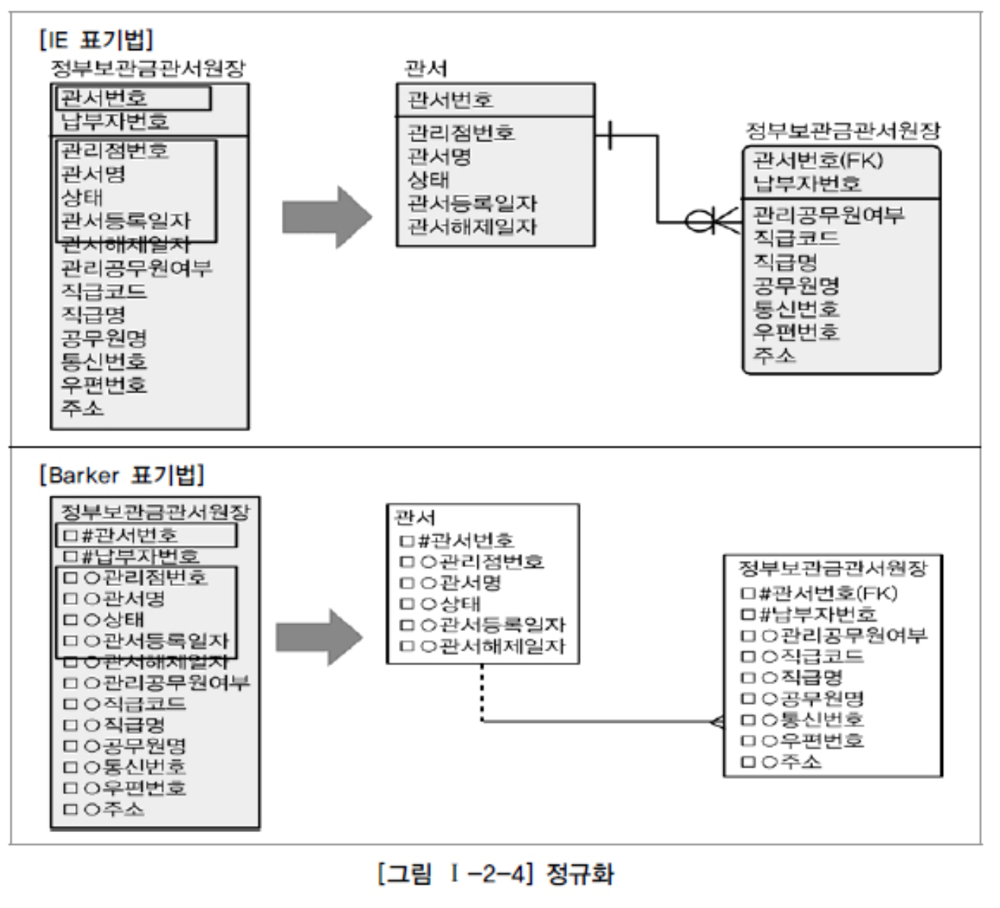
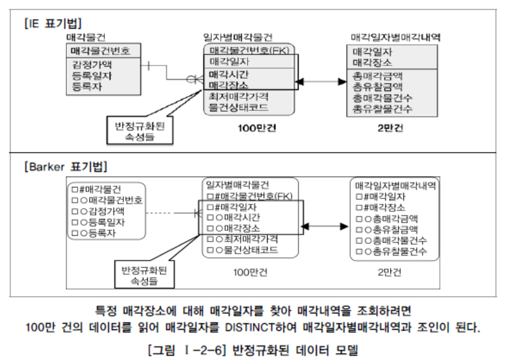
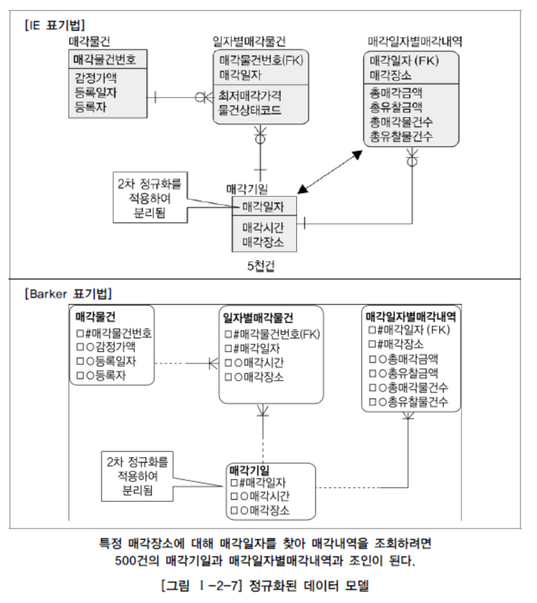
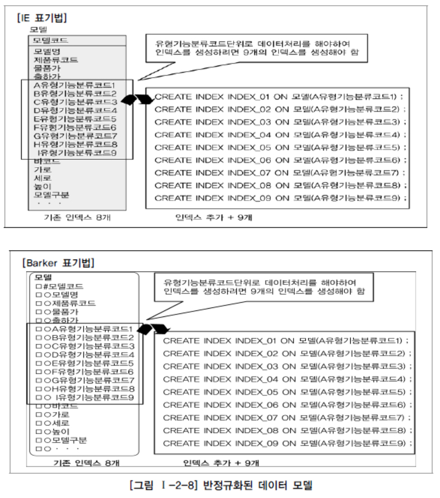
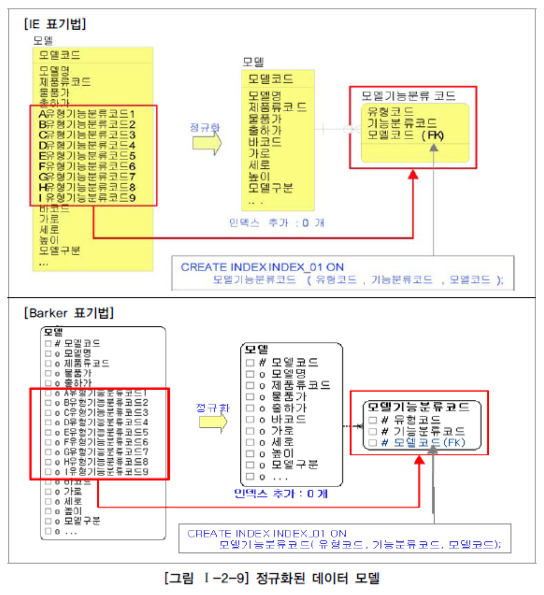
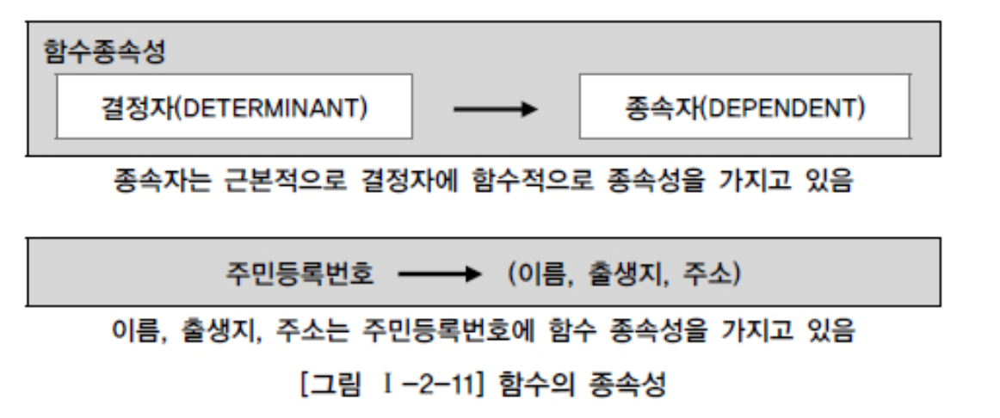

# 정규화의 성능

## 1. 정규화를 통한 성능 향상 전략

> 기본적으로 중복성 제거하기 때문에 기본적으로 성능 향상
>
> 엔터티가 계속 발생되어 SQL 문장에서 조인이 많이 발생해 성능저하도 있음

> 성능: 조회 / 입력수정삭제 두 부류

> 정규화: 데이터를 결정하는 결정자에 의해 함수적 종속을 가지고 있는 일반속성을 의존자로 하여 입력/수정/삭제 이상을 제거하는 것
>
> 결정자에 의해 동일한 의미의 일반속성이 하나의 테이블로 집약되므로 한 테이블의 데이터 용량이 최소화되는 효과

## 2. 반정규화된 테이블의 성능저하 사례 1

> 정규화로 조인이 발생되면 성능이 심각하게 저하되는가?
>
> 2차 정규화를 적용한 테이블에 대해서 조인을 하더라도 PK Unique Index 를 이용하면 조인 성능 저하는 미미함

> PK가 걸려있는 방향으로 조인이 걸려 Unique Index를 곧바로 찾아 서 데이터를 조회하기 때문에, 하나의 테이블에서 조회하는 작업과 비교했을 때 미미하게 성능 차이가 날 뿐 사용자에게 크게 영향을 줄 만큼 성능이 저하되는 일은 없는 것

> '관서등록일자가 2010년 이후 관서를 모두 조회하라' 인 경우 왼쪽은 납부자번호 모두 읽지만, 오른쪽은 관서수만큼만 조회하기 때문에 오히려 좋음

## 3. 반정규화된 테이블의 성능저하 사례 2

> case: 어떤 물건을 매각할 때 매각일자를 정하고 그 일자에 해당하는 매각시간과 매각장소가 결정하는 속성의 성격. 즉 매각일자가 결정자가 되고 매각시간과 매각장소가 의존자가 되는 함수적 종속관계가 형성되는 관계 / 매각일자가 5천건, 일자별매각물건이 100만건

​	

> 2차 정규화를 통해 매각일자를 PK 로 하고 매각시간과 매각장소가 일반속성이 됨

## 4. 반정규화된 테이블의 성능저하 사례 3

> 동일한 속성 형식을 두 개 이상의 속성으로 나열하여 반정규화한 경우

> 유형기능분류코드에 따라 각각에 대해 인덱스를 생성해야 하므로 9개나 되는 인덱스를 추가 생성해야함
>
> ​	인덱스가 많아지면 조회 성능은 향상되지만, 입력/수정/삭제 성능은 저하됨

> 분리된 테이블 모델기능분류코드에서 PK 인덱스 생성하여 성능향상

## 5. 반정규화된 테이블의 성능저하 사례 4

> 위와 동일

## 6. 함수적 종속성 (Functional Dependency) 에 근거한 정규화 수행 필요

> 함수의 종속성(Functional Dependency)은 데이터들이 어떤 기준값에 의해 종속되는 현상을 지칭하는 것이다. 이 때 기준 값을 결정자(Determinant)라 하고 종속되는 값을 종속자(Dependent)라고 한다.

> 주민번호가 이름, 출생지, 호주를 함수적으로 결정함

> 정규화의 궁극적인 목적은 반복적인 데이터를 분리하고 각 데이터가 종속된  테이블에 적절하게 (프로세스에 의해 정합성이 지켜지게) 배치되도록 하는 것