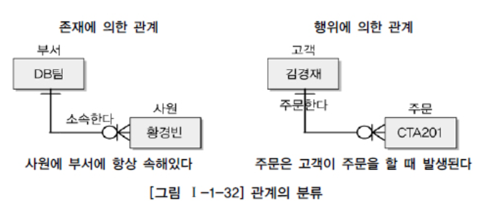
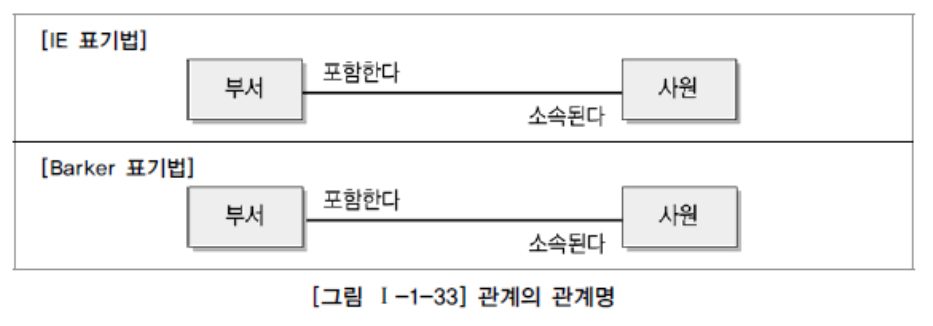
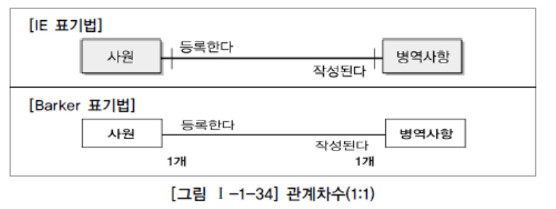
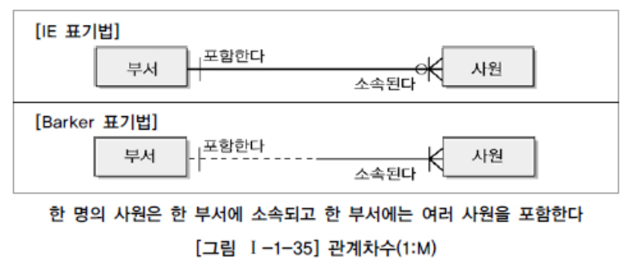
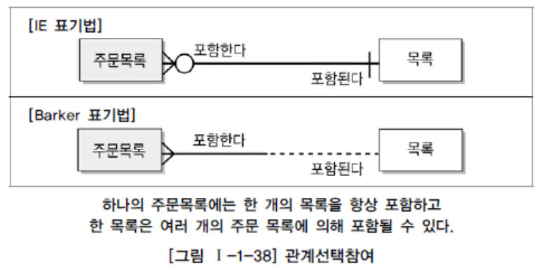

# 관계

## 1. 관계의 개념

1. ##### 관계의 정의

   > 엔터티의 인스턴스 사이의 논리적인 연관성으로서 존재의 형태로서나 행위로서 서로에게 연관성이 부여된 상태
   >
   > 엔터티와 엔터티 간 연관성 표현
   >
   > 엔터티의 정의에 따라 영향을 받기도 함
   >
   > 속성 정의 및 관계 정의에 따라서도 다양하게 변함

2. ##### 관계의 패어링

   > 엔터티 안에 인스턴스는 개별적으로 관계를 가짐 (패어링)

## 2. 관계의 분류

> 존재에 의한
>
> 행위에 의한

## 3. 관계의 표기법

1. ##### 관계명 (Membership)

   > 관계 시작점
   >
   > 관계 끝점
   >
   > 의 주체로 두 개의 관계명이 존재

   

2. ##### 관계차수 (Degree / Cardinality)

   - 1:1 관계를 표시하는 방법

     

   - 1:M 관계를 표시하는 방법

     

   - M:M 관계를 표시하는 방법

     > - 이후 두 개의 주식별자를 상속받은 관계 데이터를 이용하여 3개의 엔터티로 구분하여 표현 

3. ##### 관계선택사양 (Optionality)

   > 필수참여
   >
   > ​	참여하는 모든 참여자가 반드시 관계를 가지는, 타 엔터티의 참여자와 연결이 되어야 하는 관계
   >
   > ​	ex) 주문서는 반드시 주문목록을 가져야 함.
   >
   > 선택참여
   >
   > ​	ex) 목록과 주문목록은 선택참여. 목록은 주문이 될 수도 있고 아닐 수도 있기 때문
   >
   > 	* 물리속성에서 FK 로 연결될 경우, Null 을 허용함

   > ERD 를 나타낼 때 선택참여하는 엔터티 쪽을 원으로 표시
   >
   > 필수참여는 아무 표시 안 함

   

## 4. 관계의 정의 및 읽는 방법

1. ##### 관계 체크사항

   > 두 개의 엔터티 사이에 관심있는 연관규칙이 존재하는가?
   >  두 개의 엔터티 사이에 정보의 조합이 발생되는가?
   >  업무기술서, 장표에 관계연결에 대한 규칙이 서술되어 있는가? 업무기술서, 장표에 관계연결을 가능하게 하는 동사(Verb)가 있는가?

2. ##### 관계 읽기

   > 기준(Source) 엔터티를 한 개(One) 또는 각(Each)으로 읽는다. 대상(Target) 엔터티의 관계참여도 즉 개수(하나, 하나 이상)를 읽는다. 관계선택사양과 관계명을 읽는다.