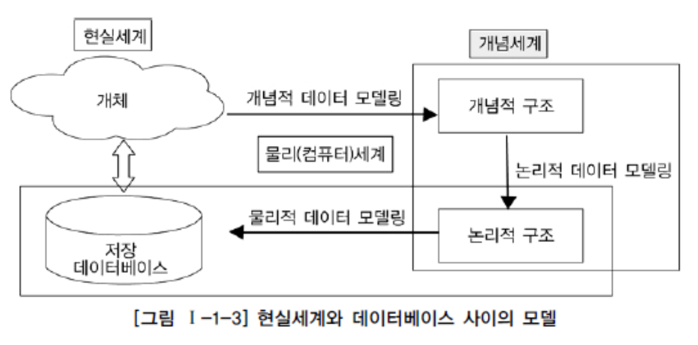
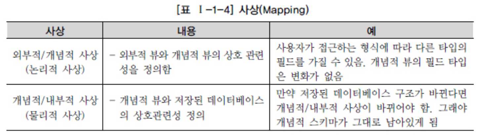
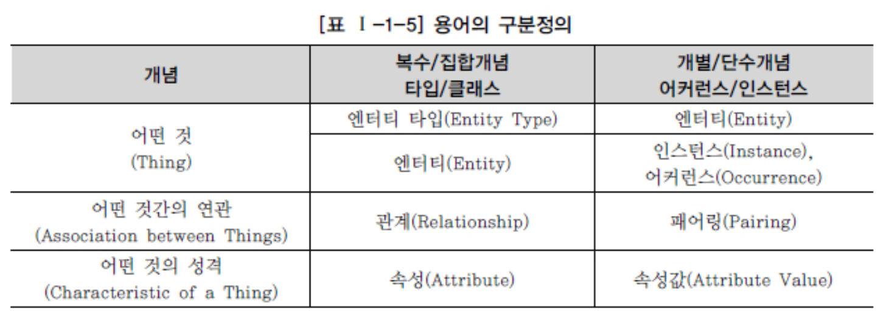

# 데이터 모델의 이해

## 1. 모델링의 이해

1. ##### 모델링의 정의

   - > Webster 사전

     가설적 또는 일정 양식에 맞춘 표현(a hypothetical or stylized representation)
      어떤 것에 대한 예비표현으로 그로부터 최종대상이 구축되도록 하는 계획으로서 기여

   - 복잡한 ‘현실세계’를 단순화시켜 표현하는 것

   - 모델이란 사물 또는 사건에 관한 양상(Aspect)이나 관점(Perspect ive)을 연관된 사람이나 그룹을 위하여 명확하게 하는 것

   - 모델이란 현실 세계의 추상화된 반영

2. ##### 모델링의 특징

   - 추상화(모형화, 가설적)는 현실세계를 일정한 형식에 맞추어 표현을 한다는 의미
   - 단순화는 복잡한 현실세계를 약속된 규약에 의해 제한된 표기법이나 언어로 표현하여 쉽게 이해할 수 있도록 하는 개념
   - 명확화는 누구나 이해하기 쉽게 하기 위해 대상에 대한 애매모호함을 제거하고 정확(正確)하게 현상을 기술

3. ##### 모델링의 세 가지 관점

   > 모델링: 업무의 내용과 정보시스템의 모습을 표기한 것

   - 데이터관점 (What, Data)

     : 업무가 어떤 데이터와 관련이 있는지 또는 데이터간의 관계는 무엇인지에 대해서 모델링하는 방법 

   - 프로세스관점 (How, Process)

     : 업무가 실제 하고 있는 일은 무엇인지 또는 무엇을 해야 하는지를 모델링하는 방법 

   - 데이터와 프로세스의 상관관점 (Interaction)

     : 업무가 처리하는 일의 방법에 따라 데이터는 어떻게 영향을 받고 있는지 모델링하는 방법 

## 2. 데이터 모델의 기본 개념의 이해

1. ##### 모델링의 정의

   > 일반적) 정보시스템을 구축하기 위해, 해당 업무에 어떤 데이터가 존재하는지 또는 업무가 필요로 하는 정보는 무엇인지를 분석하는 방법

   > 실무적)  기업 업무에 대한 종합적인 이해를 바탕으로 데이터에 존재하는 업무 규칙(Business Rule)에 대하여 참(True) 또는 거짓 (False)을 판별할 수 있는 사실(사실명제)을 데이터에 접근하는 방법(How), 사람(Who), 전산화와는 별개의(독립적인) 관점 에서 이를 명확하게 표현하는 추상화 기법

   > 정보시스템을 구축하기 위한 데이터관점의 업무분석기법
   >
   > 현실세계의 데이터에 대해 약속된 표기법에 의해 표현
   >
   > 데이터베이스를 구축하기 위한 분석/설계 과정

2. ##### 데이터 모델이 제공하는 기능

   > 시스템을 현재 또는 원하는 모습으로 가시화하도록 도와준다.
   >  시스템의 구조와 행동을 명세화 할 수 있게 한다.
   >  시스템을 구축하는 구조화된 틀을 제공한다.
   >  시스템을 구축하는 과정에서 결정한 것을 문서화한다.
   >  다양한 영역에 집중하기 위해 다른 영역의 세부 사항은 숨기는 다양한 관점을 제공한다. 특정 목표에 따라 구체화된 상세 수준의 표현방법을 제공한다.

## 3. 데이터 모델링의 중요성 및 유의점

1. ##### 파급효과 (Leverage)

   > 데이터 변경작업은 전체 시스템 구축 프로젝트에 큰 영향

2. ##### 복잡한 정보 요구사항의 간결한 표현 (Conciseness)

   > 데이터 모델은 구축할 시스템의 정보 요구사항과 한계를 가장 명확하고 간결하게 표현할 수 있는 도구

3. ##### 데이터 품질 (Data Quality)

   > 중요하니 밑에 유의점을 기술함

   - 중복(Duplication) 데이터 모델

     : 같은 데이터를 사용하는 사람, 시간, 그리고 장소를 파악하는데 도움을 줌

     ​	여러 장소에 같은 정보 저장 방지

   - 비유연성(Inflexibility)

     : 데이터의 정의를 데이터의 사용 프로세스와 분리

     ​	데이터 혹은 프로세스의 작은 변화가 데이터베이스에 중대한 변화를 일으킬 수 있는 가능성을 줄인다.

   - 비일관성(Inconsistency)

     : 데이터의 중복이 없더라도 비일관성은 발생한다.

     Ex) 신용 상태에 대한 갱신 없이 고객의 납부 이력 정보를 갱신하는 것.

     개발자가 다른 데이터와 모순된다는 고려 없이 일련의 데이터를 수정할 수 있기 때 문이다. 데이터 모델링을 할 때 데이터와 데이터간 상호 연관 관계에 대한 명확한 정의는 이러한 위험을 사전에 예방할 수 있도록 해준다.

## 4. 데이터 모델링의 3단계 진행

​	

| 데이터모델링 | 내용                                                         | 수준   |
| ------------ | ------------------------------------------------------------ | ------ |
| 개념적       | 추상화 수준이 높고 업무중심적이고 포괄적인 수준의 모델링 진행, 전사적 데이터 모델링, EA 수립시 많이 이용 | 추상적 |
| 논리적       | 시스템으로 구축하고자 하는 업무에 대해 Key, 속성, 관계 등을 정확하게 표현, 재사용성이 높음 |        |
| 물리적       | 실제로 데이터베이스에 이식할 수 있도록 성능, 저장 등 물리적인 성격을 고려하여 설계 | 구체적 |

1. ##### 개념적 데이터 모델링 (Conceptual Data Modeling)

   > 조직, 사용자의 데이터 요구사항을 찾고 분석하는데서 시작
   >
   > 어떠한 자료가 중요하고, 유지되어야 하는지
   >
   > 주요활동: 핵심 엔터티와 그들 간의 관계를 발견
   >
   > 전 조직에 걸쳐 이루어진다면, 전사적 데이터 모델

2. ##### 논리적 데이터 모델링 (Logical Data Modeling)

   > 비즈니스 정보의 논리적인 구조와 규칙을 명확하게 표현하는 기법, 과정
   >
   > 가장 핵심, 전 과정의 도구
   >
   > 정규화: 논리 데이터 모델 상세화 과정의 대표적인 활동
   >
   > ​	일관성 확보, 중복제거, 속성들이 가장 적절한 엔터티에 배치되도록 함

3. ##### 물리적 데이터 모델링 (Physical Data Modeling)

   > 논리 데이터 모델이 데이터 저장소로서 어떻게 컴퓨터 하드웨어에 표현될 것인가

## 5. 프로젝트 생명주기 (Life Cycle) 에서 데이터 모델링

## 6. 데이터 모델링에서 데이터독립성의 이해

1. ##### 데이터독립성의 필요성

   > 배경
   >
   > ​	유지보수 비용증가
   >
   > ​	데이터복잡도 증가
   >
   > ​	데이터 중복성 증가
   >
   > ​	요구사항 대응 저하

   > 효과
   >
   > ​	각 View 의 독립성을 유지하고 계층별 View 에 영향을 주지 않고 변경 가능
   >
   > ​	단계별 Schema 에 따라 데이터 정의어 (DDL) 와 데이터 조작어 (DML) 가 다름을 제공

   > 3단계로 표현된 ANSI 표준 모델을 보자
   >
   > 구조, 독립성, 사상 (Mapping)

2. ##### 데이터베이스 3단계 구조

   > ANSI / SPARC 의 3단계 구성의 데이터 독립성모델
   >
   > 외부단계 / 개념적단계 / 내부적단계

3. ##### 데이터독립성 요소

   > 데이터베이스 스키마 구조는 3단계로 구분되고 각각은 상호 독립적인 의미를 가지고 고유한 기능을 가짐

   | 항목       | 내용                                                         | 비고                                         |
   | ---------- | ------------------------------------------------------------ | -------------------------------------------- |
   | 외부스키마 | - View 단계 여러 개의 사용자 관점으로 구성, 즉 개개 사용자 단계로서 개개 사용자가 보는 개인적 DB 스키마 - DB 의 개개 사용자나 응용프로그래머가 젒근하는 DB 정의 | 사용자 관점 접근하는 특성에 따른 스키마 구성 |
   | 개념스키마 | - 개념단계 하나의 개념적 스키마로 구성 모든 사용자 관점을 통합한 조직 전체의 DB 를 기술하는 것 - 모든 응용시스템들이나 사용자들이 필요로 하는 데이터를 통합한 조직 전체의 DB 를 기술한 것으로 DB 에 저장되는 데이터와 그들간의 관계를 표현하는 스키마 | 통합관점                                     |
   | 내부스키마 | -  내부단계, 내부 스키마로 구성, DB 가 물리적으로 저장된 형식 - 물리적 장치에서 데이터가 실제적으로 저장되는 방법을 표현하는 스키마 | 물리적 저장구조                              |

4. ##### 두 영역의 데이터독립성

   > 3단계 각각의 영역에 대한 독립성을 지정하는 논리적인 독립성 / 물리적인 독립성

   | 독립성        | 내용                                                         | 특징                                                         |
   | ------------- | ------------------------------------------------------------ | ------------------------------------------------------------ |
   | 논리적독립성  | - 개념 스키마가 변경되어도 외부 스키마에는 영향을 미치지 않도록 지원하는 것 - 논리적 구조가 변경되어도 응용 프로그램에 영향 없음 | - 사용자 특성에 맞는 변경가능 - 통합 구조 변경가능      |
   | 물리적 독립성 | - 내부스키마가 변경되어도 외부/개념 스키마는 영향을 받지 않도록 지원하는 것 - 저장장치의 구조변경은 응용프로그램과 개념스키마에 영향 없음 | - 물리적 구조 영향 없이 개념구조 변경가능 - 개념구조 영향 없이 물리적인 구조 변경가능 |

5. ##### 사상 (Mapping)

   > 상호 독립적인 개념을 연결시켜주는 다리

   

## 7. 데이터 모델링의 중요한 세 가지 개념

1. ##### 데이터 모델링의 세 가지 요소

   - 업무가 관여하는 어떤 것(Things)
   - 어떤 것이 가지는 성격(Attributes)
   - 업무가 관여하는 어떤 것 간의 관계(Relationships)

   > ‘이주일과 심순애가 존재하고 둘 사이는 서로 사랑하는 연인사이이다. 이주일은 키가 180cm에 성격은 친절하고 심순애는 키가 165cm에 세심하며 활달한 성격을 가지고 있다’는 시나리오를 살펴보자. 여기에서 ‘이주일, 심순 애’는 어떤 것(Things)에 해당하고 ‘사랑하는 연인사이’가 어떤 것 간의 관계(Relationships)에 해당하며 ‘180cm에 성격은 친절, 세심하며 활달함’이 어떤 것이 가지는 성격(Attributes)에 해당한다.

2. ##### 단수와 집합 (복수) 의 명명

   

## 8. 데이터 모델링의 이해관계자

1. ##### 이해관계자의 데이터 모델링 중요성 인식

2. ##### 데이터 모델링의 이해관계자

   > 정보시스템을 구축하는 모든 사람
   >
   > 프로젝트에 참여하는 모든 IT 기술자
   >
   > 정보활르 추진하는 위치에 있는 사람

## 9. 데이터 모델의 표기법인 ERD 의 이해

1. ##### 데이터 모델 표기법

   > IE / Barker

2. ##### ERD (Entity Relationship Diagram) 표기법을 이용하여 모델링하는 방법

   - ERD 작업순서

     > 1 엔터티를 그린다. 2 엔터티를 적절하게 배치한다. 3 엔터티간 관계를 설정한다. 4 관계명을 기술한다. 5 관계의 참 여도를 기술한다. 6 관계의 필수여부를 기술한다.

   - 엔터티 배치

   - ERD 관계

     > 1. PK 로 속성이 상속되는 식별자 관계 설정

   - ERD 관계명의 표시

   - 엔터티내에 인스턴스들이 얼마나 관계에 참여하는 지를 나타내는 관계차수(Cardinality)

## 10. 좋은 데이터 모델의 요소

1. ##### 완정성 (Completeness)

   > 업무에서 필요한 모든 데이터가 데이터 모델에 정의되어 있어야 함

2. ##### 중복배제 (Non-Redundancy)

   > 하나의 데이터베이스 안에 동일한 사실은 반드시 한 번만

3. ##### 업무규칙 (Business Rules)

   > 해당 규칙에 대해 동일한 판단을 하고 데이터를 조작할 수 있도록

4. ##### 데이터 재사용 (Data Reusability)

   > 통합성과 독립성에 대해 충분히 고려

5. ##### 의사소통 (Communication)

   > 관련자들이 설계자가 정의한 업무 규칙들을 동일한 의미로 받아들이고 정보시스템을 활용할 수 있게 함

6. ##### 통합성 (Integration)

   > 동일한 데이터는 데이터베이스에 하나만 존재하고, 이를 다른 영역에서 참조, 활용하는 것
