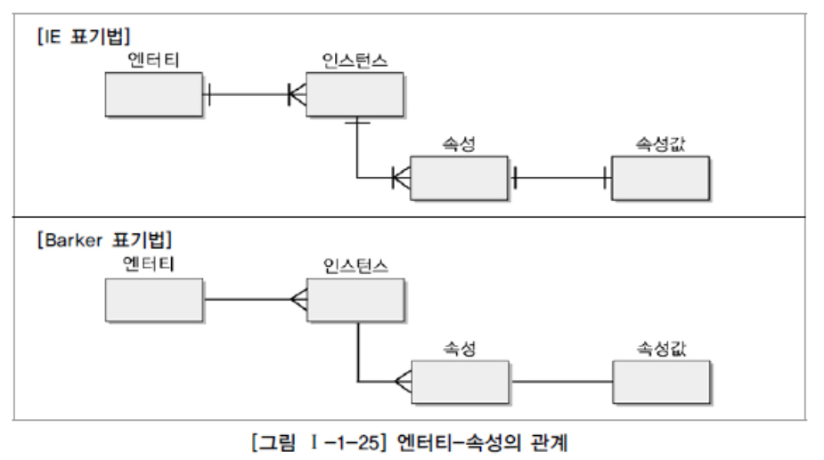
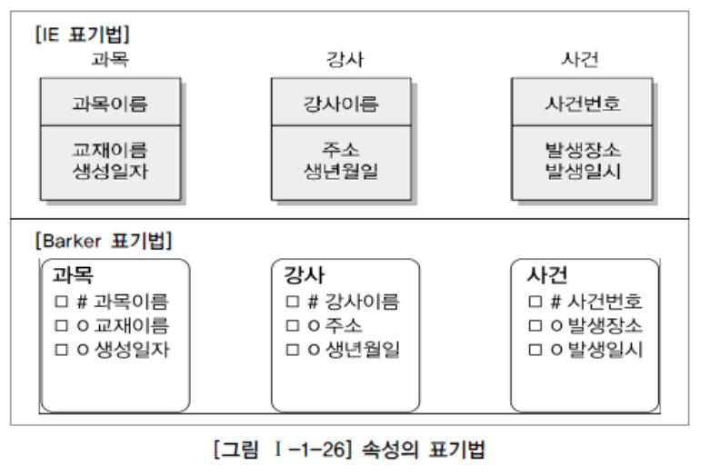

# 속성

## 1. 속성의 개념

> 인스턴스로 관리하고자 하는, 의미상 더 이상 분리되지 않는 최소 데이터 단위

> 1. 업무에서 필요로 한다.
> 2. 의미상 더 이상 분리되지 않는다.
> 3. 엔터티를 설명하고 인스턴스의 구성요소가 된다

## 2. 엔터티, 인스턴스와 속성, 속성값에 대한 내용과 표기법

1. ##### 엔터티, 인스턴스, 속성, 속성값의 관계

   - 엔터티엔 두 개 이상의 인스턴스

   - 인스턴스는 하나 이상의 속성

     > - 속성은 하나의 인스턴스에만 존재
     > - 속성은 관계로 기술될 수 없다.

   - 한 개의 속성, 한 개의 속성값

     > - 하나의 속성에 여러 개의 값이 있는 다중값일 경우, 별도의 엔터티를 이용하여 분리 한다.

1. ##### 속성의 표기법

## 3. 속성의 특징

> 1. 해당 업무에서 필요하고 관리하고자 하는 정보
> 2. 정규화 이론에 근간하여 정해진 주식별자에 함수적 종속성을 가져야 함
> 3. 하나의 속성에 여러 개의 값이 있는 다중값일 경우, 별도의 엔터티를 이용하여 분리 한다.

## 4. 속성의 분류

1. ##### 속성의 특성에 따른 분류

   - 기본속성 (Basic Attribute)

     > - 모든 속성이 해당
     > - 모든 속성 except 코드성, 엔터티식별번호, 다른속성을 계산하거나 영향받아 생성된 속성 

   - 설계속성 (Designed Attribute)

     > - 데이터 모델링을 위해 새로 만들거나 변형해서 만든 속성
     > - Ex) 코드성, 일련번호 (단일한 식별자 부여하기 위해)

   - 파생속성 (Derived Attribute)

     > - 다른 속성에 영향을 받아 발생하는 속성
     > - 유의해야할 점이 많으니 가급적 적게 정의

2. ##### 엔터티 구성방식에 따른 분류

   > PK: 엔터티를..? (인스턴스가 아니라..?) 식별할 수 있는 속성
   >
   > FK: 관계로 인해 포함되어진 속성
   >
   > 일반속성: 엔터티에 포함되어 있고, PK, FK 에 포함되지 않은 속성

   > 단순형 / 복합형 (쪼갤 수 있는지 없는지)

   > 단일값: 속성 하나에 하나의 속성값
   >
   > 다중값: 속성 하나의 여러 속성값 

## 5. 도메인

> 각 속성이 가질 수 있는 값의 범위

## 6. 속성의 명명

> 해당업무에서 사용하는 이름 부여
>
> 서술식 속성명은 사용 안 함
>
> 약어사용 가급적 제한
>
> 전체 데이터모델에서 유일성 확보

