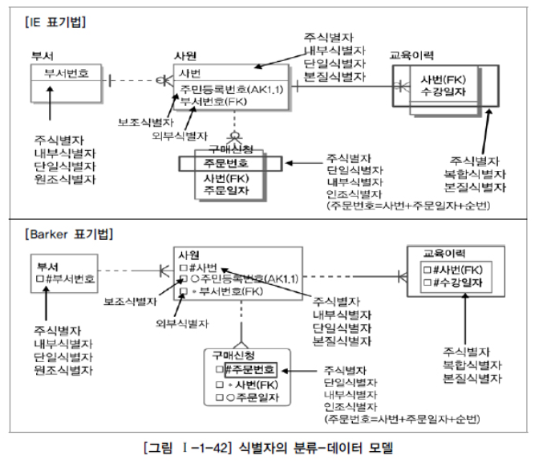
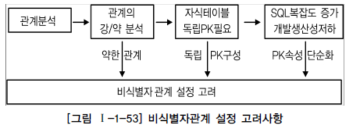
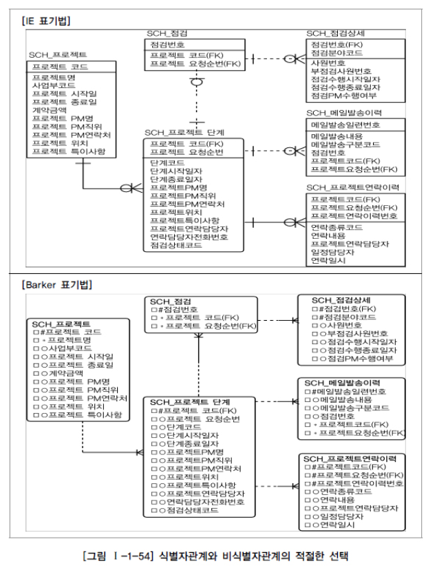

# 식별자

## 1. 식별자 (Identifiers) 개념

> 여러 개의 집합체를 담고 있는 하나의 통에서 각각을 구분할 수 있는 논리적인 이름

> 업무적으로 구분이 되는 정보로서 키와는 다르다. 키는 테이블에 접근을 위한 매개체로 물리 데이터 모델링 단계

## 2. 식별자의 특징

| 특징   | 내용                                                         | 비고                                                         |
| ------ | ------------------------------------------------------------ | ------------------------------------------------------------ |
| 유일성 | 주식별자에 의해 엔터티내에 모든 인스턴스들을 유일하게 구분함 | 사원번호가 주식별자가 모든 직원들에 대해 개인별로 고유하게 부여됨 |
| 최소성 | 주식별자를 구성하는 속성의 수는 유일성을 만족하는 최소의 수가 되어야 함 | 사원번호만으로도 고유한 구조인데 사원분류코드+사원번호로 식별자가 구성될 경우 부적절한 주식별자 구조임 |
| 불변성 | 주식별자가 한 번 특정 엔터티에 지정되면 그 식별자의 값은 변하지 않아야함 | 사원번호의 값이 변한다는 의미는 이전기록이 말소되고 새로운 기록이 발생되는 개념임 |
| 존재성 | 주식별자가 지정되면 반드시 데이터 값이 존재 (Null 안됨)      | 사원번호 없는 회사직원은 있을 수 없음                        |

## 3. 식별자 분류 및 표기법

1. ##### 식별자 분류

   |   분류   | 식별자     | 설명                                                         |
   | :------: | ---------- | ------------------------------------------------------------ |
   |  대표성  | 주식별자   | 엔터티 내에서 각 어커런스를 구분 / 타 엔터티와 참조관계를 연결할 수 있음 |
   |   여부   | 보조식별자 | 엔터티 내에서 각 어커런스를 구분 /  대표성을 가지지 못해 참조관계 연결 못 함 |
   |  스스로  | 내부식별자 | 엔터티 내부에서 스스로 만들어지는 식별자                     |
   | 생성여부 | 외부식별자 | 타 엔터티와의 관계를 통해 받아오는 식별자                    |
   |  속성의  | 단일식별자 | 하나의 속성으로 구성된 식별자                                |
   |    수    | 복합식별자 | 둘 이상의 속성으로 구성된 식별자                             |
   |   대체   | 본질식별자 | 업무에 의해 만들어지는 식별자                                |
   |   여부   | 인조식별자 | 원조식별자가 복잡한 구성을 갖고 있기 때문에 인위적의로 만든 식별자 |

2. ##### 식별자 표기법

   

## 4. 주식별자 도출기준

1. ##### 해당 업무에서 자주 이용되는 속성을 주식별자로 지정하도록 함

   > 유일하게 식별가능한 속성
   >
   > Ex) 사원번호 (속성)

2. ##### 명칭, 내역 등과 같이 이름으로 기술되는 것은 피함

   > 이름이 같을 수 있고, 길어지면 조건절에 기술할 때 틀림

3. ##### 속성의 수가 많아지지 않도록 함

   > 주식별자 속성이 복합일 때, 가능하면 주식별자 속성 많지 않게

## 5. 식별자관계와 비식별자관계에 따른 식별자

1. ##### 식별자관계와 비식별자 관계의 결정

   > 외부식별자(Foreign Identifier)는 자기 자신 엔터티에서 필요하지 않고, 다른 엔터티와의 관계를 통해서 자식 엔터티에 생성되는 속성
   >
   > 데이터베이스 생성시 FK 역할을 함
   >
   > 이 때 부모로부터 받은 외부식별자를 자신의 주식별자로 할 것인지, 아님 부모와 연결만 되는 속성으로 할 것인지 결정해야함.

2. ##### 식별자관계 (Identifying Relationship)

   > 부모의 주식별자가 상속되어 자식엔터티의 주식별자가 되는 경우

3. ##### 비식별자관계 (Non-Identifying Relationship)

   > 부모로부터 속성을 받았지만, 주식별자로 안 쓰고 일반적인 속성으로만 쓰는 경우

   - 필수가 아닌 경우
   - 엔터티별로 데이터의 생명주기(Life Cycle)를 다르게 관리할 경우
     - Ex) 부모엔터티에 인스턴스가 자식의 엔터티와 관계를 가지고 있었지만 자식만 남겨두고 먼저 소멸될 수 있는 경우.
     - 이에 대한 방안: 물리데이터베이스 생성 시 Foreign Key를 연결하지 않는 임시적인 방법을 사용하기도 하지만 데이터 모델상에서 관계를 비식별 자관계로 조정하는 것이 가장 좋은 방법.
   - 여러 개의 엔터티가 하나의 엔터티로 통합되어 표현되었는데 각각의 엔터티가 별도의 관계를 가질 때.
   - 자식엔터티에 주식별자로 사용하여도 되지만 자식엔터티에서 별도의 주식별자를 생성하는 것이 더 유리하다고 판단 될 때

4. ##### 식별자 관계로만 설정할 경우의 문제점

   > 주식별자가 많아지기 때문에 복잡해지며 오류가능성 유발

5. ##### 비식별자 관계로만 설정할 경우의 문제점

   > - 일반적으로 각각의 엔터티에는 중요한 `기준 속성` 이 있다.
   >   - 후에 상속을 위해 기준이 필요함

6. ##### 식별자관계와 비식별자관계 모델링

   - 비식별자관계 선택 프로세스

     > 자식엔터티의 독립된 주식별자 구성이 필요한지가 가장 중요

     

   - 식별자와 비식별자관계 비교

     | 항목               | 식별자관계                                                   | 비식별자관계                                                 |
     | ------------------ | ------------------------------------------------------------ | ------------------------------------------------------------ |
     | 목적               | 강한 연결관계 표현                                           | 약한 연결관계 표현                                           |
     | 자식 주식별자 영향 | 자식 주식별자의 구성에 포함됨                                | 자식 일반 속성에 포함됨                                      |
     | 표기법             | 실선 표현                                                    | 점선 표현                                                    |
     | 연결 고려사항      | - 반드시 부모엔터티 종속 - 자식 주식별자구성에 부모 주식별자포함필요 - 상속받은 주식별자속성을 타 엔터티에 이전 필요 | - 약한 종속관계 - 자식 주식별자구성을 독립적으로 구성 - 자식 주식별자구성에 부모 주식별자 부분 필요 - 상속받은 주식별자속성을 타 엔터티에 차단 필요 - 부모쪽의 관계참여가 선택관계 |

     

   - 식별자와 비식별자를 적용한 데이터 모델

     > 위를 고려해 균형있게 표현한 데이터 모델

     

