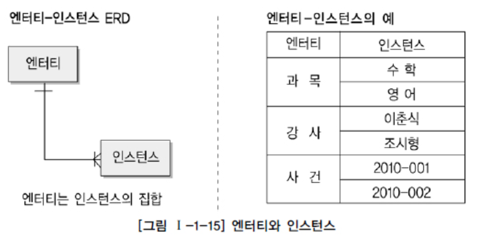
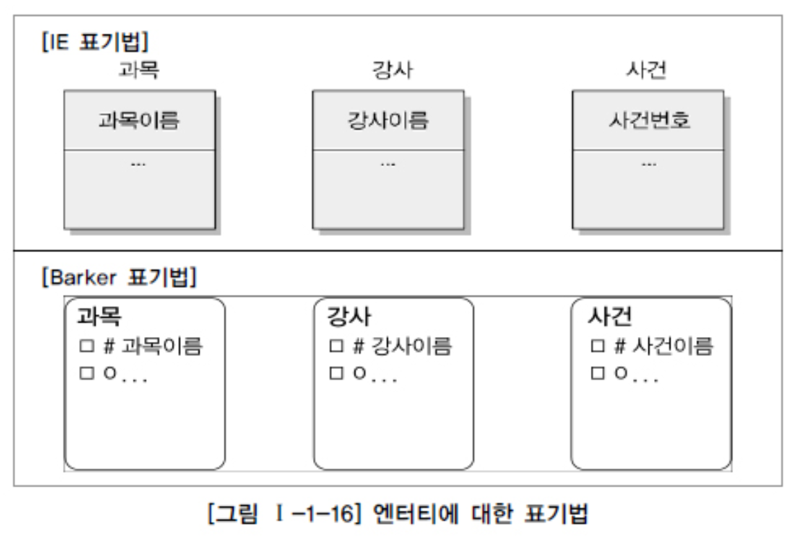
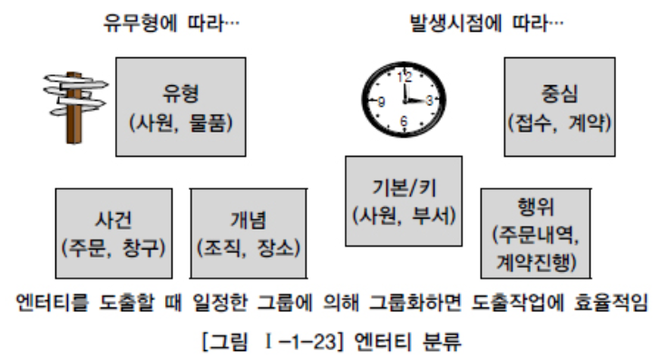

# 엔터티

## 1. 엔터티의 개념

업무에 필요하고 유용한 정보를 저장하고 관리하기 위한 집합적인 것(Thing)

## 2. 엔터티와 인스턴스에 대한 내용과 표기법

|  |  |
| ----------------------------- | ----------------------------- |
|                               |                               |

## 3. 엔터티의 특징

> 아래를 만족하지 않으면 적절하지 않은 엔터티일 수 있음

1. **업무에서 필요로 하는 정보**
2. **식별이 가능해야 함**
   - 인스턴스 각각을 구분하기 위한 유일한 식별자가 존재
3. **인스턴스의 집합**
   - 엔터티의 인스턴스는 두 개 이상이어야함
4. **업무프로세스에 의해 이용**
   - 업무에서 필요하고, 실제로 업무프로세스에서 이용되어야 함
   - 업무 프로세스에 의해 CRUD 가 발생하지 않는다면, 엔터티를 제거하거나, 누락된 프로세스가 없는지 검토
5. **속성 (attributes) 을 포함**
6. **관계의 존재**
   - 엔터티는 최소 한 개 이상의 관계가 존재
     - 기본적으로 엔터티가 도출되었다는 것은 해당 업무 내에서 업무적인 연관성을 갖기 때문
   - 다만) 통계, 코드, 내부 필요 엔터티는 관계를 생략한다.

## 4. 엔터티의 분류

1. **유무형에 따른 분류**
   - 유형엔터티
     - 물리적형태, 안정적, 지속적으로 활용되는 엔터티
     - ex) 사원, 물품, 강사
   - 개념엔터티
     - 관리해야 할 개념적 정보
     - ex) 조직, 보험상품
   - 사건엔터티
     - 업무를 수행함에 따라 발생되는 엔터티
     - 비교적 발생량이 많음
     - 각종 통계자료에 이용
     - ex) 주문, 청구, 미납
2. **발생시점에 따른 분류**
   - 기본엔터티
     - 원래 존재하여 다른 엔터티로부터 생성된 것이 아닌 독립적 생성
     - 타 엔터티의 부모 역할
   - 중심엔터티
     - 기본엔터티로부터 발생
     - 업무에 중심역할
     - 데이터가 많이 발생되어 관계를 통해 많은 행위엔터티를 생성
   - 행위엔터티
     - 두 개 이상의 부모 엔터티
     - 자주 내용이 바뀌고 데이터량이 증가
     - Ex) 주문목록, 사원변경이력
3. **엔터티 분류 방법의 예**

## 5. 엔터티의 명명

1. 현업에서 사용하는 용어
2. 약어 노노
3. 단수명사
4. 모든 엔터티 중 유일한
5. 생성의미대로 이름 부여