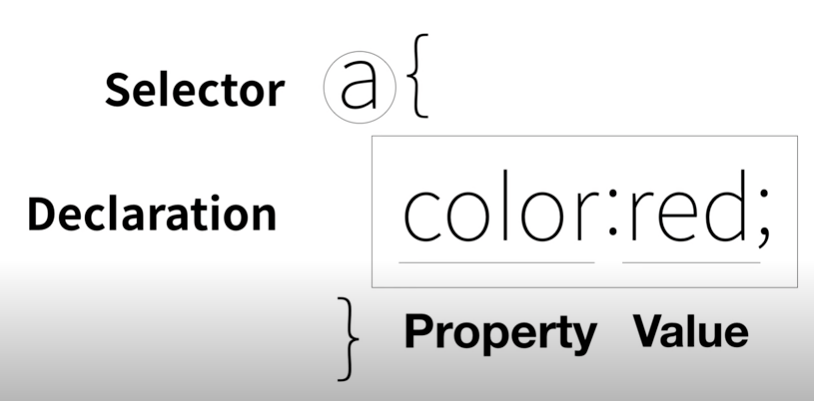

# CSS 101

> Cascading Style Sheets

​	

원하고자 하는 기능의 property 를 구글링 하자


1. style 태그 쓰기

   ```html
   <style>
           a {
               color:red;
               text-decoration: none;
           }
   </style>
   ```

   

2. style 속성 쓰기

   ```html
   <li><a href="1.html"><font color='red'> HTML </font></a> </li>
   ```

   

## Selector

> id < class < tag
>
> css seclector 를 검색해보자

1. tag

   - 모든 태그에 대해

2. .class

   ```html
   <style>
     .class1 {
       ~
     }
     .class2 {
       
     }
   </style>
   
   <body>
     <class='class1 class2'> </>
       -> style 태그에서 순서대로 됨
   </body>
   ```

3. #id

4. 어떤 id 안의 어떤 태그

   ```html
   # id tag {
   
   }
   ```

   

   

## Property

1. border

2. display

3. padding

   > 요소가 차지하는 칸

4. margin

   > 요소간 차지하는 칸

5. width

   > 가로 차지하는 칸

6. display

   > 강력함. 어떻게 보이는지 해줄 수 있음 inline block 바꿀 수 있고 none 가능


## Box

1. block level element (div)

   > 전체를 씀

2. Inline element (span)

   > 요소만큼만 씀

   


## Grid

> css 의 최신기술

1. how to use

   ```html
   <style>
           #grid {
               border:5px solid pink;
               display: grid;
               grid-template-columns: 150px 1fr;
             # 150을 고정으로 같고 Fr 은 나머지 것과 비율로 나눠같는다.
           }
           div {
               border: 5px solid gray;
           }
   </style>
   ```

   

## 미디어 쿼리

> 디바이스마다, 화면의 크기에 따라 보여지는 것 다르게

- how to use

  ```html
  <!DOCTYPE html>
  <html lang="en">
  <head>
      <meta charset="UTF-8">
      <title></title>
      <style>
          div {
              border: 5px solid green;
              font-size: 60px;
          }
          /* screen width > 800px */
          @media(max-width:800px){
              div {
                  display:none;
              }
          }
      </style>
  </head>
  <body>
      <div>
          Responsive
      </div>
  </body>
  </html>
  ```

- how to use 2

  ```html
  <style>
          body {
              margin: 0px;
          }
          #active {
              color: red;
          }
          .saw {
              color: gray;
          }
          a {
              color:black;
              text-decoration: none;
          }
          h1 {
              font-size: 45px;
              text-align: center;
              border-bottom: 1px solid gray;
              margin: 0;
              padding: 20px;
          }
          ol {
              border-right: 1px solid gray ;
              width: 100px;
              margin: 0px;
              padding: 20px;
          }
          #grid {
              display: grid;
              grid-template-columns: 150px 1fr;
          }
          #grid ol {
              padding-left: 33px;
          }
          #grid #article {
              padding-left: 25px;
          }
          @media(max-width: 800px){
              #grid {
              display: block
              }
              ol {
              border-right: none ;
              }
              h1 {
              border-bottom: none;
          }
      </style>
  ```

  

## css 파일 재사용하기

> style.css 파일을 만들어서 재활용하자

- html

  ```html
  <link rel="stylesheet" href="style.css">
  ```

- style.css

  ```
  style 태그를 제외하고 작성
  ```

  

