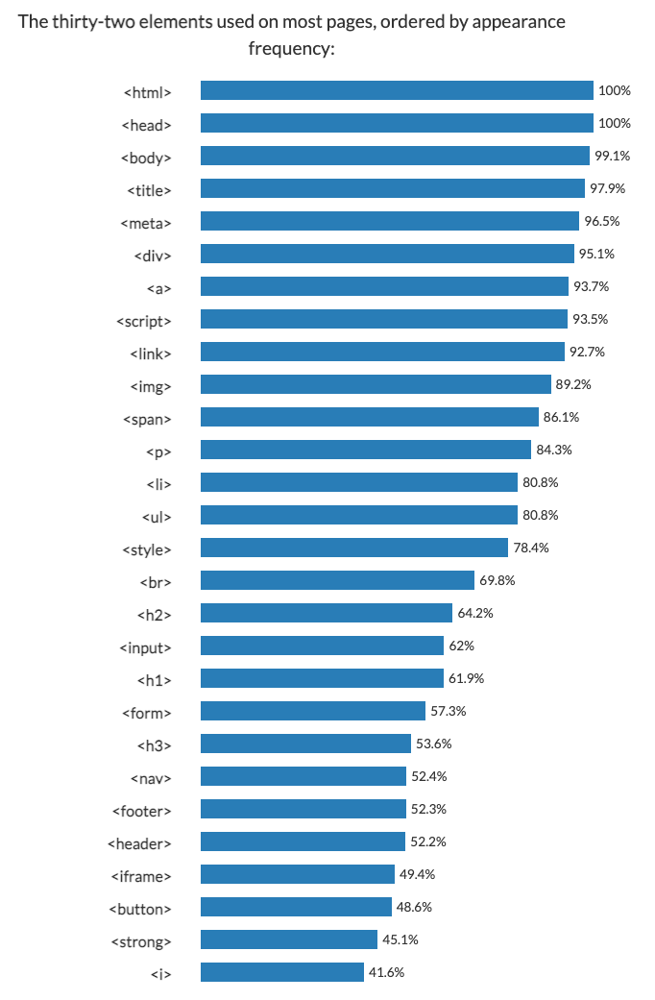

# HTML 101

> HyperText Markup Language

## Tag, element 

> html 요소

- Tag 는 주기능뿐만 아니라 검색엔진에서, web 의 본질적인 정보라는 측면에서도 의미를 같는다.



- head tags

  | Tag   | Description |
  | ----- | ----------- |
  | title |             |
  | Meta  |             |
  | Style |             |

  

- Body Tags

  | Tag   | Description                              |
  | ----- | ---------------------------------------- |
  | p     | 한 단락의 단위                           |
  | br    | 줄바꿈                                   |
  | li    | 리스트를 의미하며 자동으로 띄어쓰기가 됨 |
  | ol    | li 의 부모태그로서 넘버링이 됨           |
  | ul    | unordered list 그저 li 의 부모태그       |
  | table | Tr, tr 가 함께 함                        |
  | a     | Anchor 링크                              |

  

## Attribute

> 각 태그마다 속성을 부여할 수 있다.

- 태그안에서 상관없다
- style
  - 모든 태그에 style 속성은 css 속성을 가짐
- a
  - href: 이동할 주소
  - target
    - "_blank": 새 창에서 열기
  - Title
